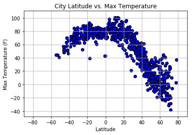
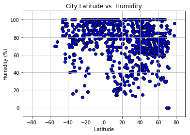
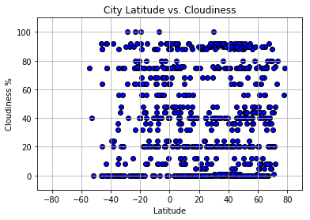
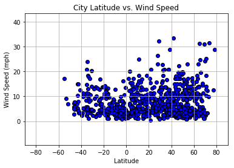

# WeatherPy

- Observation 1: As the city gets closer to equator, the temperature does look like it tends to rise. For the most part, there are trend looks to increase as it goes to zero from both the southern side and northern side.
- Observation 2: In the northern hemisphere, greater latitudes, it seems like there is a wider range of humidity percentages where as the southern hemisphere seems to be more highly concentrated toward the 100% humidity.
- Observation 3: There is definitely some selection errors or bias that are possible. The method I used to select the cities used the nearest_city function. The nearest_city function looks at the coordinates and finds the closest city. This means that if a city is in isolation and not near any other city, the city could be randomly selected using a wider variety of coordinates. This method of selecting data could be improved if we knew all the cities in the weather database and then randomly selecting a city from that population to ensure that it is more randomly selected.


```python
# Dependencies
import pandas as pd
import random
import numpy as np
import matplotlib.pyplot as plt
import requests
import json
import openweathermapy.core as owm
from citipy import citipy
URLending = '&APPID=fe3aa2c2a09c1550bb84707e6ee2be75&units=imperial'
url = 'http://api.openweathermap.org/data/2.5/weather?q='
```


```python
# create list of random longitude and latitude to use nearest city function
randLon = random.sample(range(-18000, 18000), 2500)
lon = []
for number in randLon:
    lon.append(number/100.00)
# lon
randLat = random.sample(range(-9000, 9000), 2500)
lat = []
for number in randLat:
    lat.append(number/100.00)
# lat
coordDF = pd.DataFrame({"Lon": lon,
                       "Lat": lat})
coordDF.head()
```


<div>
<style>
    .dataframe thead tr:only-child th {
        text-align: right;
    }

    .dataframe thead th {
        text-align: left;
    }

    .dataframe tbody tr th {
        vertical-align: top;
    }
</style>
<table border="1" class="dataframe">
  <thead>
    <tr style="text-align: right;">
      <th></th>
      <th>Lat</th>
      <th>Lon</th>
    </tr>
  </thead>
  <tbody>
    <tr>
      <th>0</th>
      <td>62.89</td>
      <td>-20.06</td>
    </tr>
    <tr>
      <th>1</th>
      <td>-4.78</td>
      <td>155.76</td>
    </tr>
    <tr>
      <th>2</th>
      <td>30.79</td>
      <td>32.63</td>
    </tr>
    <tr>
      <th>3</th>
      <td>63.14</td>
      <td>142.52</td>
    </tr>
    <tr>
      <th>4</th>
      <td>5.41</td>
      <td>3.21</td>
    </tr>
  </tbody>
</table>
</div>


```python
# get city list
cityList = []
for index, row in coordDF.iterrows():
    city = citipy.nearest_city(row[0], row[1])
    cityList.append(city.city_name)
# print (cityList)
cityDF = pd.DataFrame({'city': cityList})
cityDF = cityDF.drop_duplicates()
cityDF = cityDF.reset_index()
cityDF = cityDF[['city']]
len(cityDF)
```


    889


```python
rawdata = []

for city in cityDF['city']:
    fullURL = url + city + URLending
#     print (fullURL)
    weather = requests.get(fullURL).json()
    rawdata.append(weather)
# print (currentWeather)
len(rawdata)


```


    889


```python
temp = []
longitude = []
latitude = []
humidity = []
cloudiness = []
windspeed = []
country = []
cities = []

for city in rawdata:
    try:
        cities.append(city['name'])
    except:
        pass
# print (cities)
print (len(cities))

availableAPI = []

for city in cities:
    fullURL = url + city + URLending
    print (fullURL)
    newWeather = requests.get(fullURL).json()
    availableAPI.append(newWeather)
# print (availableAPI)
print (len(availableAPI))
for city in availableAPI:
    temp.append(city['main']['temp_max'])
    longitude.append(city['coord']['lon'])
    latitude.append(city['coord']['lat'])
    humidity.append(city['main']['humidity'])
    cloudiness.append(city['clouds']['all'])
    windspeed.append(city['wind']['speed'])
    country.append(city['sys']['country'])

```

    806
    http://api.openweathermap.org/data/2.5/weather?q=Vestmannaeyjar&APPID=fe3aa2c2a09c1550bb84707e6ee2be75&units=imperial
    http://api.openweathermap.org/data/2.5/weather?q=Kieta&APPID=fe3aa2c2a09c1550bb84707e6ee2be75&units=imperial
    http://api.openweathermap.org/data/2.5/weather?q=Ismailia&APPID=fe3aa2c2a09c1550bb84707e6ee2be75&units=imperial
    http://api.openweathermap.org/data/2.5/weather?q=Ust-Nera&APPID=fe3aa2c2a09c1550bb84707e6ee2be75&units=imperial
    http://api.openweathermap.org/data/2.5/weather?q=Lagos&APPID=fe3aa2c2a09c1550bb84707e6ee2be75&units=imperial
    http://api.openweathermap.org/data/2.5/weather?q=Cape Town&APPID=fe3aa2c2a09c1550bb84707e6ee2be75&units=imperial
    http://api.openweathermap.org/data/2.5/weather?q=Bluff&APPID=fe3aa2c2a09c1550bb84707e6ee2be75&units=imperial
    http://api.openweathermap.org/data/2.5/weather?q=Naryan-Mar&APPID=fe3aa2c2a09c1550bb84707e6ee2be75&units=imperial
    http://api.openweathermap.org/data/2.5/weather?q=Puerto Ayora&APPID=fe3aa2c2a09c1550bb84707e6ee2be75&units=imperial
    http://api.openweathermap.org/data/2.5/weather?q=Hobart&APPID=fe3aa2c2a09c1550bb84707e6ee2be75&units=imperial
    http://api.openweathermap.org/data/2.5/weather?q=Clyde River&APPID=fe3aa2c2a09c1550bb84707e6ee2be75&units=imperial
    http://api.openweathermap.org/data/2.5/weather?q=Vaini&APPID=fe3aa2c2a09c1550bb84707e6ee2be75&units=imperial
    http://api.openweathermap.org/data/2.5/weather?q=Katsuura&APPID=fe3aa2c2a09c1550bb84707e6ee2be75&units=imperial
    http://api.openweathermap.org/data/2.5/weather?q=Auki&APPID=fe3aa2c2a09c1550bb84707e6ee2be75&units=imperial
    http://api.openweathermap.org/data/2.5/weather?q=Porto Novo&APPID=fe3aa2c2a09c1550bb84707e6ee2be75&units=imperial
    http://api.openweathermap.org/data/2.5/weather?q=Maunabo&APPID=fe3aa2c2a09c1550bb84707e6ee2be75&units=imperial
    http://api.openweathermap.org/data/2.5/weather?q=Yellowknife&APPID=fe3aa2c2a09c1550bb84707e6ee2be75&units=imperial
    http://api.openweathermap.org/data/2.5/weather?q=Ilulissat&APPID=fe3aa2c2a09c1550bb84707e6ee2be75&units=imperial
    http://api.openweathermap.org/data/2.5/weather?q=Hofn&APPID=fe3aa2c2a09c1550bb84707e6ee2be75&units=imperial
    http://api.openweathermap.org/data/2.5/weather?q=Ratnagiri&APPID=fe3aa2c2a09c1550bb84707e6ee2be75&units=imperial
    http://api.openweathermap.org/data/2.5/weather?q=Kizlyar&APPID=fe3aa2c2a09c1550bb84707e6ee2be75&units=imperial
    http://api.openweathermap.org/data/2.5/weather?q=Chokurdakh&APPID=fe3aa2c2a09c1550bb84707e6ee2be75&units=imperial
    http://api.openweathermap.org/data/2.5/weather?q=Khatanga&APPID=fe3aa2c2a09c1550bb84707e6ee2be75&units=imperial
    http://api.openweathermap.org/data/2.5/weather?q=Punta Arenas&APPID=fe3aa2c2a09c1550bb84707e6ee2be75&units=imperial
    http://api.openweathermap.org/data/2.5/weather?q=Chuy&APPID=fe3aa2c2a09c1550bb84707e6ee2be75&units=imperial
    http://api.openweathermap.org/data/2.5/weather?q=Ancud&APPID=fe3aa2c2a09c1550bb84707e6ee2be75&units=imperial
    http://api.openweathermap.org/data/2.5/weather?q=Hermanus&APPID=fe3aa2c2a09c1550bb84707e6ee2be75&units=imperial
    http://api.openweathermap.org/data/2.5/weather?q=Lompoc&APPID=fe3aa2c2a09c1550bb84707e6ee2be75&units=imperial
    http://api.openweathermap.org/data/2.5/weather?q=Narsaq&APPID=fe3aa2c2a09c1550bb84707e6ee2be75&units=imperial
    http://api.openweathermap.org/data/2.5/weather?q=Viga&APPID=fe3aa2c2a09c1550bb84707e6ee2be75&units=imperial
    http://api.openweathermap.org/data/2.5/weather?q=Nemuro&APPID=fe3aa2c2a09c1550bb84707e6ee2be75&units=imperial
    http://api.openweathermap.org/data/2.5/weather?q=Rikitea&APPID=fe3aa2c2a09c1550bb84707e6ee2be75&units=imperial
    http://api.openweathermap.org/data/2.5/weather?q=Ellisras&APPID=fe3aa2c2a09c1550bb84707e6ee2be75&units=imperial
    http://api.openweathermap.org/data/2.5/weather?q=Ushuaia&APPID=fe3aa2c2a09c1550bb84707e6ee2be75&units=imperial
    http://api.openweathermap.org/data/2.5/weather?q=Codrington&APPID=fe3aa2c2a09c1550bb84707e6ee2be75&units=imperial
    http://api.openweathermap.org/data/2.5/weather?q=Portland&APPID=fe3aa2c2a09c1550bb84707e6ee2be75&units=imperial
    http://api.openweathermap.org/data/2.5/weather?q=Souillac&APPID=fe3aa2c2a09c1550bb84707e6ee2be75&units=imperial
    http://api.openweathermap.org/data/2.5/weather?q=Longyearbyen&APPID=fe3aa2c2a09c1550bb84707e6ee2be75&units=imperial
    http://api.openweathermap.org/data/2.5/weather?q=Ponta do Sol&APPID=fe3aa2c2a09c1550bb84707e6ee2be75&units=imperial
    http://api.openweathermap.org/data/2.5/weather?q=Vila Franca do Campo&APPID=fe3aa2c2a09c1550bb84707e6ee2be75&units=imperial
    http://api.openweathermap.org/data/2.5/weather?q=Provideniya&APPID=fe3aa2c2a09c1550bb84707e6ee2be75&units=imperial
    http://api.openweathermap.org/data/2.5/weather?q=Pontes e Lacerda&APPID=fe3aa2c2a09c1550bb84707e6ee2be75&units=imperial
    http://api.openweathermap.org/data/2.5/weather?q=Kapaa&APPID=fe3aa2c2a09c1550bb84707e6ee2be75&units=imperial
    http://api.openweathermap.org/data/2.5/weather?q=Atuona&APPID=fe3aa2c2a09c1550bb84707e6ee2be75&units=imperial
    http://api.openweathermap.org/data/2.5/weather?q=Saint-Philippe&APPID=fe3aa2c2a09c1550bb84707e6ee2be75&units=imperial
    http://api.openweathermap.org/data/2.5/weather?q=Norman Wells&APPID=fe3aa2c2a09c1550bb84707e6ee2be75&units=imperial
    http://api.openweathermap.org/data/2.5/weather?q=Port Alfred&APPID=fe3aa2c2a09c1550bb84707e6ee2be75&units=imperial
    http://api.openweathermap.org/data/2.5/weather?q=Nouadhibou&APPID=fe3aa2c2a09c1550bb84707e6ee2be75&units=imperial
    http://api.openweathermap.org/data/2.5/weather?q=Mahebourg&APPID=fe3aa2c2a09c1550bb84707e6ee2be75&units=imperial
    http://api.openweathermap.org/data/2.5/weather?q=Butaritari&APPID=fe3aa2c2a09c1550bb84707e6ee2be75&units=imperial
    http://api.openweathermap.org/data/2.5/weather?q=Bredasdorp&APPID=fe3aa2c2a09c1550bb84707e6ee2be75&units=imperial
    http://api.openweathermap.org/data/2.5/weather?q=Saskylakh&APPID=fe3aa2c2a09c1550bb84707e6ee2be75&units=imperial
    http://api.openweathermap.org/data/2.5/weather?q=Alekseyevsk&APPID=fe3aa2c2a09c1550bb84707e6ee2be75&units=imperial
    http://api.openweathermap.org/data/2.5/weather?q=Touros&APPID=fe3aa2c2a09c1550bb84707e6ee2be75&units=imperial
    http://api.openweathermap.org/data/2.5/weather?q=Pringsewu&APPID=fe3aa2c2a09c1550bb84707e6ee2be75&units=imperial
    http://api.openweathermap.org/data/2.5/weather?q=San Ramon de la Nueva Oran&APPID=fe3aa2c2a09c1550bb84707e6ee2be75&units=imperial
    http://api.openweathermap.org/data/2.5/weather?q=Gabu&APPID=fe3aa2c2a09c1550bb84707e6ee2be75&units=imperial
    http://api.openweathermap.org/data/2.5/weather?q=Great Falls&APPID=fe3aa2c2a09c1550bb84707e6ee2be75&units=imperial
    http://api.openweathermap.org/data/2.5/weather?q=Ketchikan&APPID=fe3aa2c2a09c1550bb84707e6ee2be75&units=imperial
    http://api.openweathermap.org/data/2.5/weather?q=Upernavik&APPID=fe3aa2c2a09c1550bb84707e6ee2be75&units=imperial
    http://api.openweathermap.org/data/2.5/weather?q=Ulladulla&APPID=fe3aa2c2a09c1550bb84707e6ee2be75&units=imperial
    http://api.openweathermap.org/data/2.5/weather?q=Bady Bassitt&APPID=fe3aa2c2a09c1550bb84707e6ee2be75&units=imperial
    http://api.openweathermap.org/data/2.5/weather?q=Busselton&APPID=fe3aa2c2a09c1550bb84707e6ee2be75&units=imperial
    http://api.openweathermap.org/data/2.5/weather?q=Nizwa&APPID=fe3aa2c2a09c1550bb84707e6ee2be75&units=imperial
    http://api.openweathermap.org/data/2.5/weather?q=Dolores&APPID=fe3aa2c2a09c1550bb84707e6ee2be75&units=imperial
    http://api.openweathermap.org/data/2.5/weather?q=Hilo&APPID=fe3aa2c2a09c1550bb84707e6ee2be75&units=imperial
    http://api.openweathermap.org/data/2.5/weather?q=Saint George&APPID=fe3aa2c2a09c1550bb84707e6ee2be75&units=imperial
    http://api.openweathermap.org/data/2.5/weather?q=Kodiak&APPID=fe3aa2c2a09c1550bb84707e6ee2be75&units=imperial
    http://api.openweathermap.org/data/2.5/weather?q=Christchurch&APPID=fe3aa2c2a09c1550bb84707e6ee2be75&units=imperial
    http://api.openweathermap.org/data/2.5/weather?q=Vryburg&APPID=fe3aa2c2a09c1550bb84707e6ee2be75&units=imperial
    http://api.openweathermap.org/data/2.5/weather?q=Victoria&APPID=fe3aa2c2a09c1550bb84707e6ee2be75&units=imperial
    http://api.openweathermap.org/data/2.5/weather?q=Arkhangelsk&APPID=fe3aa2c2a09c1550bb84707e6ee2be75&units=imperial
    http://api.openweathermap.org/data/2.5/weather?q=Ust-Kuyga&APPID=fe3aa2c2a09c1550bb84707e6ee2be75&units=imperial
    http://api.openweathermap.org/data/2.5/weather?q=Lodwar&APPID=fe3aa2c2a09c1550bb84707e6ee2be75&units=imperial
    http://api.openweathermap.org/data/2.5/weather?q=Severo-Kurilsk&APPID=fe3aa2c2a09c1550bb84707e6ee2be75&units=imperial
    http://api.openweathermap.org/data/2.5/weather?q=Roald&APPID=fe3aa2c2a09c1550bb84707e6ee2be75&units=imperial
    http://api.openweathermap.org/data/2.5/weather?q=Sao Filipe&APPID=fe3aa2c2a09c1550bb84707e6ee2be75&units=imperial
    http://api.openweathermap.org/data/2.5/weather?q=Castro&APPID=fe3aa2c2a09c1550bb84707e6ee2be75&units=imperial
    http://api.openweathermap.org/data/2.5/weather?q=Behbahan&APPID=fe3aa2c2a09c1550bb84707e6ee2be75&units=imperial
    http://api.openweathermap.org/data/2.5/weather?q=Labuhan&APPID=fe3aa2c2a09c1550bb84707e6ee2be75&units=imperial
    http://api.openweathermap.org/data/2.5/weather?q=New Norfolk&APPID=fe3aa2c2a09c1550bb84707e6ee2be75&units=imperial
    http://api.openweathermap.org/data/2.5/weather?q=Port Elizabeth&APPID=fe3aa2c2a09c1550bb84707e6ee2be75&units=imperial
    http://api.openweathermap.org/data/2.5/weather?q=Nakusp&APPID=fe3aa2c2a09c1550bb84707e6ee2be75&units=imperial
    http://api.openweathermap.org/data/2.5/weather?q=Hithadhoo&APPID=fe3aa2c2a09c1550bb84707e6ee2be75&units=imperial
    http://api.openweathermap.org/data/2.5/weather?q=Half Moon Bay&APPID=fe3aa2c2a09c1550bb84707e6ee2be75&units=imperial
    http://api.openweathermap.org/data/2.5/weather?q=Cherskiy&APPID=fe3aa2c2a09c1550bb84707e6ee2be75&units=imperial
    http://api.openweathermap.org/data/2.5/weather?q=Cabo San Lucas&APPID=fe3aa2c2a09c1550bb84707e6ee2be75&units=imperial
    http://api.openweathermap.org/data/2.5/weather?q=Ribeira Grande&APPID=fe3aa2c2a09c1550bb84707e6ee2be75&units=imperial
    http://api.openweathermap.org/data/2.5/weather?q=Homer&APPID=fe3aa2c2a09c1550bb84707e6ee2be75&units=imperial
    http://api.openweathermap.org/data/2.5/weather?q=Thompson&APPID=fe3aa2c2a09c1550bb84707e6ee2be75&units=imperial
    http://api.openweathermap.org/data/2.5/weather?q=Mataura&APPID=fe3aa2c2a09c1550bb84707e6ee2be75&units=imperial
    http://api.openweathermap.org/data/2.5/weather?q=Lavrentiya&APPID=fe3aa2c2a09c1550bb84707e6ee2be75&units=imperial
    http://api.openweathermap.org/data/2.5/weather?q=The Valley&APPID=fe3aa2c2a09c1550bb84707e6ee2be75&units=imperial
    http://api.openweathermap.org/data/2.5/weather?q=Mar del Plata&APPID=fe3aa2c2a09c1550bb84707e6ee2be75&units=imperial
    http://api.openweathermap.org/data/2.5/weather?q=Kununurra&APPID=fe3aa2c2a09c1550bb84707e6ee2be75&units=imperial
    http://api.openweathermap.org/data/2.5/weather?q=Albany&APPID=fe3aa2c2a09c1550bb84707e6ee2be75&units=imperial
    http://api.openweathermap.org/data/2.5/weather?q=Simpang&APPID=fe3aa2c2a09c1550bb84707e6ee2be75&units=imperial
    http://api.openweathermap.org/data/2.5/weather?q=Kailua&APPID=fe3aa2c2a09c1550bb84707e6ee2be75&units=imperial
    http://api.openweathermap.org/data/2.5/weather?q=Seydi&APPID=fe3aa2c2a09c1550bb84707e6ee2be75&units=imperial
    http://api.openweathermap.org/data/2.5/weather?q=Tuktoyaktuk&APPID=fe3aa2c2a09c1550bb84707e6ee2be75&units=imperial
    http://api.openweathermap.org/data/2.5/weather?q=Riachao das Neves&APPID=fe3aa2c2a09c1550bb84707e6ee2be75&units=imperial
    http://api.openweathermap.org/data/2.5/weather?q=Goderich&APPID=fe3aa2c2a09c1550bb84707e6ee2be75&units=imperial
    http://api.openweathermap.org/data/2.5/weather?q=Skibbereen&APPID=fe3aa2c2a09c1550bb84707e6ee2be75&units=imperial
    http://api.openweathermap.org/data/2.5/weather?q=Ventspils&APPID=fe3aa2c2a09c1550bb84707e6ee2be75&units=imperial
    http://api.openweathermap.org/data/2.5/weather?q=Esperance&APPID=fe3aa2c2a09c1550bb84707e6ee2be75&units=imperial
    http://api.openweathermap.org/data/2.5/weather?q=Geraldton&APPID=fe3aa2c2a09c1550bb84707e6ee2be75&units=imperial
    http://api.openweathermap.org/data/2.5/weather?q=Severomuysk&APPID=fe3aa2c2a09c1550bb84707e6ee2be75&units=imperial
    http://api.openweathermap.org/data/2.5/weather?q=Palmer&APPID=fe3aa2c2a09c1550bb84707e6ee2be75&units=imperial
    http://api.openweathermap.org/data/2.5/weather?q=Dikson&APPID=fe3aa2c2a09c1550bb84707e6ee2be75&units=imperial
    http://api.openweathermap.org/data/2.5/weather?q=Udgir&APPID=fe3aa2c2a09c1550bb84707e6ee2be75&units=imperial
    http://api.openweathermap.org/data/2.5/weather?q=Nikolskoye&APPID=fe3aa2c2a09c1550bb84707e6ee2be75&units=imperial
    http://api.openweathermap.org/data/2.5/weather?q=Doctor Mora&APPID=fe3aa2c2a09c1550bb84707e6ee2be75&units=imperial
    http://api.openweathermap.org/data/2.5/weather?q=Faanui&APPID=fe3aa2c2a09c1550bb84707e6ee2be75&units=imperial
    http://api.openweathermap.org/data/2.5/weather?q=Kaitangata&APPID=fe3aa2c2a09c1550bb84707e6ee2be75&units=imperial
    http://api.openweathermap.org/data/2.5/weather?q=Barrow&APPID=fe3aa2c2a09c1550bb84707e6ee2be75&units=imperial
    http://api.openweathermap.org/data/2.5/weather?q=Salina Cruz&APPID=fe3aa2c2a09c1550bb84707e6ee2be75&units=imperial
    http://api.openweathermap.org/data/2.5/weather?q=Port Moresby&APPID=fe3aa2c2a09c1550bb84707e6ee2be75&units=imperial
    http://api.openweathermap.org/data/2.5/weather?q=Santa Marta&APPID=fe3aa2c2a09c1550bb84707e6ee2be75&units=imperial
    http://api.openweathermap.org/data/2.5/weather?q=Point Pedro&APPID=fe3aa2c2a09c1550bb84707e6ee2be75&units=imperial
    http://api.openweathermap.org/data/2.5/weather?q=Luanda&APPID=fe3aa2c2a09c1550bb84707e6ee2be75&units=imperial
    http://api.openweathermap.org/data/2.5/weather?q=Avarua&APPID=fe3aa2c2a09c1550bb84707e6ee2be75&units=imperial
    http://api.openweathermap.org/data/2.5/weather?q=Taltal&APPID=fe3aa2c2a09c1550bb84707e6ee2be75&units=imperial
    http://api.openweathermap.org/data/2.5/weather?q=Terenos&APPID=fe3aa2c2a09c1550bb84707e6ee2be75&units=imperial
    http://api.openweathermap.org/data/2.5/weather?q=Portobelo&APPID=fe3aa2c2a09c1550bb84707e6ee2be75&units=imperial
    http://api.openweathermap.org/data/2.5/weather?q=Lixourion&APPID=fe3aa2c2a09c1550bb84707e6ee2be75&units=imperial
    http://api.openweathermap.org/data/2.5/weather?q=Parchim&APPID=fe3aa2c2a09c1550bb84707e6ee2be75&units=imperial
    http://api.openweathermap.org/data/2.5/weather?q=Flagstaff&APPID=fe3aa2c2a09c1550bb84707e6ee2be75&units=imperial
    http://api.openweathermap.org/data/2.5/weather?q=Axim&APPID=fe3aa2c2a09c1550bb84707e6ee2be75&units=imperial
    http://api.openweathermap.org/data/2.5/weather?q=Noumea&APPID=fe3aa2c2a09c1550bb84707e6ee2be75&units=imperial
    http://api.openweathermap.org/data/2.5/weather?q=Narragansett&APPID=fe3aa2c2a09c1550bb84707e6ee2be75&units=imperial
    http://api.openweathermap.org/data/2.5/weather?q=Dyersburg&APPID=fe3aa2c2a09c1550bb84707e6ee2be75&units=imperial
    http://api.openweathermap.org/data/2.5/weather?q=Constitucion&APPID=fe3aa2c2a09c1550bb84707e6ee2be75&units=imperial
    http://api.openweathermap.org/data/2.5/weather?q=Deloraine&APPID=fe3aa2c2a09c1550bb84707e6ee2be75&units=imperial
    http://api.openweathermap.org/data/2.5/weather?q=Coahuayana&APPID=fe3aa2c2a09c1550bb84707e6ee2be75&units=imperial
    http://api.openweathermap.org/data/2.5/weather?q=Terrace&APPID=fe3aa2c2a09c1550bb84707e6ee2be75&units=imperial
    http://api.openweathermap.org/data/2.5/weather?q=Hamilton&APPID=fe3aa2c2a09c1550bb84707e6ee2be75&units=imperial
    http://api.openweathermap.org/data/2.5/weather?q=East London&APPID=fe3aa2c2a09c1550bb84707e6ee2be75&units=imperial
    http://api.openweathermap.org/data/2.5/weather?q=Bambous Virieux&APPID=fe3aa2c2a09c1550bb84707e6ee2be75&units=imperial
    http://api.openweathermap.org/data/2.5/weather?q=Hattiesburg&APPID=fe3aa2c2a09c1550bb84707e6ee2be75&units=imperial
    http://api.openweathermap.org/data/2.5/weather?q=Bekhtery&APPID=fe3aa2c2a09c1550bb84707e6ee2be75&units=imperial
    http://api.openweathermap.org/data/2.5/weather?q=Georgetown&APPID=fe3aa2c2a09c1550bb84707e6ee2be75&units=imperial
    http://api.openweathermap.org/data/2.5/weather?q=Velyka Bahachka&APPID=fe3aa2c2a09c1550bb84707e6ee2be75&units=imperial
    http://api.openweathermap.org/data/2.5/weather?q=Dan Khun Thot&APPID=fe3aa2c2a09c1550bb84707e6ee2be75&units=imperial
    http://api.openweathermap.org/data/2.5/weather?q=Bonavista&APPID=fe3aa2c2a09c1550bb84707e6ee2be75&units=imperial
    http://api.openweathermap.org/data/2.5/weather?q=Severobaykalsk&APPID=fe3aa2c2a09c1550bb84707e6ee2be75&units=imperial
    http://api.openweathermap.org/data/2.5/weather?q=Vao&APPID=fe3aa2c2a09c1550bb84707e6ee2be75&units=imperial
    http://api.openweathermap.org/data/2.5/weather?q=Srednekolymsk&APPID=fe3aa2c2a09c1550bb84707e6ee2be75&units=imperial
    http://api.openweathermap.org/data/2.5/weather?q=Samarai&APPID=fe3aa2c2a09c1550bb84707e6ee2be75&units=imperial
    http://api.openweathermap.org/data/2.5/weather?q=Husavik&APPID=fe3aa2c2a09c1550bb84707e6ee2be75&units=imperial
    http://api.openweathermap.org/data/2.5/weather?q=Rawson&APPID=fe3aa2c2a09c1550bb84707e6ee2be75&units=imperial
    http://api.openweathermap.org/data/2.5/weather?q=Panzhihua&APPID=fe3aa2c2a09c1550bb84707e6ee2be75&units=imperial
    http://api.openweathermap.org/data/2.5/weather?q=Puqi&APPID=fe3aa2c2a09c1550bb84707e6ee2be75&units=imperial
    http://api.openweathermap.org/data/2.5/weather?q=Cascais&APPID=fe3aa2c2a09c1550bb84707e6ee2be75&units=imperial
    http://api.openweathermap.org/data/2.5/weather?q=Namibe&APPID=fe3aa2c2a09c1550bb84707e6ee2be75&units=imperial
    http://api.openweathermap.org/data/2.5/weather?q=Euskirchen&APPID=fe3aa2c2a09c1550bb84707e6ee2be75&units=imperial
    http://api.openweathermap.org/data/2.5/weather?q=Igarka&APPID=fe3aa2c2a09c1550bb84707e6ee2be75&units=imperial
    http://api.openweathermap.org/data/2.5/weather?q=Suhbaatar&APPID=fe3aa2c2a09c1550bb84707e6ee2be75&units=imperial
    http://api.openweathermap.org/data/2.5/weather?q=Phan Thiet&APPID=fe3aa2c2a09c1550bb84707e6ee2be75&units=imperial
    http://api.openweathermap.org/data/2.5/weather?q=Lufkin&APPID=fe3aa2c2a09c1550bb84707e6ee2be75&units=imperial
    http://api.openweathermap.org/data/2.5/weather?q=Gedangan&APPID=fe3aa2c2a09c1550bb84707e6ee2be75&units=imperial
    http://api.openweathermap.org/data/2.5/weather?q=Syracuse&APPID=fe3aa2c2a09c1550bb84707e6ee2be75&units=imperial
    http://api.openweathermap.org/data/2.5/weather?q=Khandyga&APPID=fe3aa2c2a09c1550bb84707e6ee2be75&units=imperial
    http://api.openweathermap.org/data/2.5/weather?q=Khabez&APPID=fe3aa2c2a09c1550bb84707e6ee2be75&units=imperial
    http://api.openweathermap.org/data/2.5/weather?q=Coihaique&APPID=fe3aa2c2a09c1550bb84707e6ee2be75&units=imperial
    http://api.openweathermap.org/data/2.5/weather?q=Okakarara&APPID=fe3aa2c2a09c1550bb84707e6ee2be75&units=imperial
    http://api.openweathermap.org/data/2.5/weather?q=Waitati&APPID=fe3aa2c2a09c1550bb84707e6ee2be75&units=imperial
    http://api.openweathermap.org/data/2.5/weather?q=Mozhga&APPID=fe3aa2c2a09c1550bb84707e6ee2be75&units=imperial
    http://api.openweathermap.org/data/2.5/weather?q=Torbay&APPID=fe3aa2c2a09c1550bb84707e6ee2be75&units=imperial
    http://api.openweathermap.org/data/2.5/weather?q=Tasiilaq&APPID=fe3aa2c2a09c1550bb84707e6ee2be75&units=imperial
    http://api.openweathermap.org/data/2.5/weather?q=San Juan&APPID=fe3aa2c2a09c1550bb84707e6ee2be75&units=imperial
    http://api.openweathermap.org/data/2.5/weather?q=Vila&APPID=fe3aa2c2a09c1550bb84707e6ee2be75&units=imperial
    http://api.openweathermap.org/data/2.5/weather?q=Nichinan&APPID=fe3aa2c2a09c1550bb84707e6ee2be75&units=imperial
    http://api.openweathermap.org/data/2.5/weather?q=Talnakh&APPID=fe3aa2c2a09c1550bb84707e6ee2be75&units=imperial
    http://api.openweathermap.org/data/2.5/weather?q=Isangel&APPID=fe3aa2c2a09c1550bb84707e6ee2be75&units=imperial
    http://api.openweathermap.org/data/2.5/weather?q=Alofi&APPID=fe3aa2c2a09c1550bb84707e6ee2be75&units=imperial
    http://api.openweathermap.org/data/2.5/weather?q=Grand Gaube&APPID=fe3aa2c2a09c1550bb84707e6ee2be75&units=imperial
    http://api.openweathermap.org/data/2.5/weather?q=Rio Grande&APPID=fe3aa2c2a09c1550bb84707e6ee2be75&units=imperial
    http://api.openweathermap.org/data/2.5/weather?q=Jalu&APPID=fe3aa2c2a09c1550bb84707e6ee2be75&units=imperial
    http://api.openweathermap.org/data/2.5/weather?q=Verkhneyarkeyevo&APPID=fe3aa2c2a09c1550bb84707e6ee2be75&units=imperial
    http://api.openweathermap.org/data/2.5/weather?q=Erice&APPID=fe3aa2c2a09c1550bb84707e6ee2be75&units=imperial
    http://api.openweathermap.org/data/2.5/weather?q=Tyazhinskiy&APPID=fe3aa2c2a09c1550bb84707e6ee2be75&units=imperial
    http://api.openweathermap.org/data/2.5/weather?q=Inhambane&APPID=fe3aa2c2a09c1550bb84707e6ee2be75&units=imperial
    http://api.openweathermap.org/data/2.5/weather?q=Dingle&APPID=fe3aa2c2a09c1550bb84707e6ee2be75&units=imperial
    http://api.openweathermap.org/data/2.5/weather?q=Voronovytsya&APPID=fe3aa2c2a09c1550bb84707e6ee2be75&units=imperial
    http://api.openweathermap.org/data/2.5/weather?q=Tiarei&APPID=fe3aa2c2a09c1550bb84707e6ee2be75&units=imperial
    http://api.openweathermap.org/data/2.5/weather?q=Jamestown&APPID=fe3aa2c2a09c1550bb84707e6ee2be75&units=imperial
    http://api.openweathermap.org/data/2.5/weather?q=Kaduqli&APPID=fe3aa2c2a09c1550bb84707e6ee2be75&units=imperial
    http://api.openweathermap.org/data/2.5/weather?q=Mariveles&APPID=fe3aa2c2a09c1550bb84707e6ee2be75&units=imperial
    http://api.openweathermap.org/data/2.5/weather?q=Santa Cruz de la Palma&APPID=fe3aa2c2a09c1550bb84707e6ee2be75&units=imperial
    http://api.openweathermap.org/data/2.5/weather?q=Yatou&APPID=fe3aa2c2a09c1550bb84707e6ee2be75&units=imperial
    http://api.openweathermap.org/data/2.5/weather?q=Nantucket&APPID=fe3aa2c2a09c1550bb84707e6ee2be75&units=imperial
    http://api.openweathermap.org/data/2.5/weather?q=Mahajanga&APPID=fe3aa2c2a09c1550bb84707e6ee2be75&units=imperial
    http://api.openweathermap.org/data/2.5/weather?q=Pevek&APPID=fe3aa2c2a09c1550bb84707e6ee2be75&units=imperial
    http://api.openweathermap.org/data/2.5/weather?q=Ucluelet&APPID=fe3aa2c2a09c1550bb84707e6ee2be75&units=imperial
    http://api.openweathermap.org/data/2.5/weather?q=Lakatoro&APPID=fe3aa2c2a09c1550bb84707e6ee2be75&units=imperial
    http://api.openweathermap.org/data/2.5/weather?q=Mattru&APPID=fe3aa2c2a09c1550bb84707e6ee2be75&units=imperial
    http://api.openweathermap.org/data/2.5/weather?q=San Vicente&APPID=fe3aa2c2a09c1550bb84707e6ee2be75&units=imperial
    http://api.openweathermap.org/data/2.5/weather?q=Peace River&APPID=fe3aa2c2a09c1550bb84707e6ee2be75&units=imperial
    http://api.openweathermap.org/data/2.5/weather?q=Lebu&APPID=fe3aa2c2a09c1550bb84707e6ee2be75&units=imperial
    http://api.openweathermap.org/data/2.5/weather?q=Rafaela&APPID=fe3aa2c2a09c1550bb84707e6ee2be75&units=imperial
    http://api.openweathermap.org/data/2.5/weather?q=Comodoro Rivadavia&APPID=fe3aa2c2a09c1550bb84707e6ee2be75&units=imperial
    http://api.openweathermap.org/data/2.5/weather?q=Qaqortoq&APPID=fe3aa2c2a09c1550bb84707e6ee2be75&units=imperial
    http://api.openweathermap.org/data/2.5/weather?q=Abu Samrah&APPID=fe3aa2c2a09c1550bb84707e6ee2be75&units=imperial
    http://api.openweathermap.org/data/2.5/weather?q=Boyolangu&APPID=fe3aa2c2a09c1550bb84707e6ee2be75&units=imperial
    http://api.openweathermap.org/data/2.5/weather?q=La Mana&APPID=fe3aa2c2a09c1550bb84707e6ee2be75&units=imperial
    http://api.openweathermap.org/data/2.5/weather?q=Beringovskiy&APPID=fe3aa2c2a09c1550bb84707e6ee2be75&units=imperial
    http://api.openweathermap.org/data/2.5/weather?q=Maldonado&APPID=fe3aa2c2a09c1550bb84707e6ee2be75&units=imperial
    http://api.openweathermap.org/data/2.5/weather?q=Rakhiv&APPID=fe3aa2c2a09c1550bb84707e6ee2be75&units=imperial
    http://api.openweathermap.org/data/2.5/weather?q=Kedrovyy&APPID=fe3aa2c2a09c1550bb84707e6ee2be75&units=imperial
    http://api.openweathermap.org/data/2.5/weather?q=Hasaki&APPID=fe3aa2c2a09c1550bb84707e6ee2be75&units=imperial
    http://api.openweathermap.org/data/2.5/weather?q=Qaanaaq&APPID=fe3aa2c2a09c1550bb84707e6ee2be75&units=imperial
    http://api.openweathermap.org/data/2.5/weather?q=Mackay&APPID=fe3aa2c2a09c1550bb84707e6ee2be75&units=imperial
    http://api.openweathermap.org/data/2.5/weather?q=Mahibadhoo&APPID=fe3aa2c2a09c1550bb84707e6ee2be75&units=imperial
    http://api.openweathermap.org/data/2.5/weather?q=Tautira&APPID=fe3aa2c2a09c1550bb84707e6ee2be75&units=imperial
    http://api.openweathermap.org/data/2.5/weather?q=Batemans Bay&APPID=fe3aa2c2a09c1550bb84707e6ee2be75&units=imperial
    http://api.openweathermap.org/data/2.5/weather?q=Cidreira&APPID=fe3aa2c2a09c1550bb84707e6ee2be75&units=imperial
    http://api.openweathermap.org/data/2.5/weather?q=Luderitz&APPID=fe3aa2c2a09c1550bb84707e6ee2be75&units=imperial
    http://api.openweathermap.org/data/2.5/weather?q=Ossora&APPID=fe3aa2c2a09c1550bb84707e6ee2be75&units=imperial
    http://api.openweathermap.org/data/2.5/weather?q=Klaksvik&APPID=fe3aa2c2a09c1550bb84707e6ee2be75&units=imperial
    http://api.openweathermap.org/data/2.5/weather?q=Dunedin&APPID=fe3aa2c2a09c1550bb84707e6ee2be75&units=imperial
    http://api.openweathermap.org/data/2.5/weather?q=Newport&APPID=fe3aa2c2a09c1550bb84707e6ee2be75&units=imperial
    http://api.openweathermap.org/data/2.5/weather?q=Sao Joao da Barra&APPID=fe3aa2c2a09c1550bb84707e6ee2be75&units=imperial
    http://api.openweathermap.org/data/2.5/weather?q=Pangkalanbuun&APPID=fe3aa2c2a09c1550bb84707e6ee2be75&units=imperial
    http://api.openweathermap.org/data/2.5/weather?q=Grindavik&APPID=fe3aa2c2a09c1550bb84707e6ee2be75&units=imperial
    http://api.openweathermap.org/data/2.5/weather?q=Cairns&APPID=fe3aa2c2a09c1550bb84707e6ee2be75&units=imperial
    http://api.openweathermap.org/data/2.5/weather?q=Ankpa&APPID=fe3aa2c2a09c1550bb84707e6ee2be75&units=imperial
    http://api.openweathermap.org/data/2.5/weather?q=Atambua&APPID=fe3aa2c2a09c1550bb84707e6ee2be75&units=imperial
    http://api.openweathermap.org/data/2.5/weather?q=Lerwick&APPID=fe3aa2c2a09c1550bb84707e6ee2be75&units=imperial
    http://api.openweathermap.org/data/2.5/weather?q=Honiara&APPID=fe3aa2c2a09c1550bb84707e6ee2be75&units=imperial
    http://api.openweathermap.org/data/2.5/weather?q=Maceio&APPID=fe3aa2c2a09c1550bb84707e6ee2be75&units=imperial
    http://api.openweathermap.org/data/2.5/weather?q=Arlington&APPID=fe3aa2c2a09c1550bb84707e6ee2be75&units=imperial
    http://api.openweathermap.org/data/2.5/weather?q=Banjar&APPID=fe3aa2c2a09c1550bb84707e6ee2be75&units=imperial
    http://api.openweathermap.org/data/2.5/weather?q=Tevaitoa&APPID=fe3aa2c2a09c1550bb84707e6ee2be75&units=imperial
    http://api.openweathermap.org/data/2.5/weather?q=Iskateley&APPID=fe3aa2c2a09c1550bb84707e6ee2be75&units=imperial
    http://api.openweathermap.org/data/2.5/weather?q=Perpignan&APPID=fe3aa2c2a09c1550bb84707e6ee2be75&units=imperial
    http://api.openweathermap.org/data/2.5/weather?q=Akdepe&APPID=fe3aa2c2a09c1550bb84707e6ee2be75&units=imperial
    http://api.openweathermap.org/data/2.5/weather?q=Sirjan&APPID=fe3aa2c2a09c1550bb84707e6ee2be75&units=imperial
    http://api.openweathermap.org/data/2.5/weather?q=Mama&APPID=fe3aa2c2a09c1550bb84707e6ee2be75&units=imperial
    http://api.openweathermap.org/data/2.5/weather?q=Port Lincoln&APPID=fe3aa2c2a09c1550bb84707e6ee2be75&units=imperial
    http://api.openweathermap.org/data/2.5/weather?q=Meulaboh&APPID=fe3aa2c2a09c1550bb84707e6ee2be75&units=imperial
    http://api.openweathermap.org/data/2.5/weather?q=Hammerfest&APPID=fe3aa2c2a09c1550bb84707e6ee2be75&units=imperial
    http://api.openweathermap.org/data/2.5/weather?q=Saint-Joseph&APPID=fe3aa2c2a09c1550bb84707e6ee2be75&units=imperial
    http://api.openweathermap.org/data/2.5/weather?q=Oytal&APPID=fe3aa2c2a09c1550bb84707e6ee2be75&units=imperial
    http://api.openweathermap.org/data/2.5/weather?q=Arraial do Cabo&APPID=fe3aa2c2a09c1550bb84707e6ee2be75&units=imperial
    http://api.openweathermap.org/data/2.5/weather?q=Tsiroanomandidy&APPID=fe3aa2c2a09c1550bb84707e6ee2be75&units=imperial
    http://api.openweathermap.org/data/2.5/weather?q=Lorengau&APPID=fe3aa2c2a09c1550bb84707e6ee2be75&units=imperial
    http://api.openweathermap.org/data/2.5/weather?q=Dong Hoi&APPID=fe3aa2c2a09c1550bb84707e6ee2be75&units=imperial
    http://api.openweathermap.org/data/2.5/weather?q=Tual&APPID=fe3aa2c2a09c1550bb84707e6ee2be75&units=imperial
    http://api.openweathermap.org/data/2.5/weather?q=Aklavik&APPID=fe3aa2c2a09c1550bb84707e6ee2be75&units=imperial
    http://api.openweathermap.org/data/2.5/weather?q=Simbahan&APPID=fe3aa2c2a09c1550bb84707e6ee2be75&units=imperial
    http://api.openweathermap.org/data/2.5/weather?q=Bethel&APPID=fe3aa2c2a09c1550bb84707e6ee2be75&units=imperial
    http://api.openweathermap.org/data/2.5/weather?q=Amapa&APPID=fe3aa2c2a09c1550bb84707e6ee2be75&units=imperial
    http://api.openweathermap.org/data/2.5/weather?q=Moron&APPID=fe3aa2c2a09c1550bb84707e6ee2be75&units=imperial
    http://api.openweathermap.org/data/2.5/weather?q=Gizo&APPID=fe3aa2c2a09c1550bb84707e6ee2be75&units=imperial
    http://api.openweathermap.org/data/2.5/weather?q=Gorom-Gorom&APPID=fe3aa2c2a09c1550bb84707e6ee2be75&units=imperial
    http://api.openweathermap.org/data/2.5/weather?q=Salalah&APPID=fe3aa2c2a09c1550bb84707e6ee2be75&units=imperial
    http://api.openweathermap.org/data/2.5/weather?q=Kavieng&APPID=fe3aa2c2a09c1550bb84707e6ee2be75&units=imperial
    http://api.openweathermap.org/data/2.5/weather?q=Buchanan&APPID=fe3aa2c2a09c1550bb84707e6ee2be75&units=imperial
    http://api.openweathermap.org/data/2.5/weather?q=Aonla&APPID=fe3aa2c2a09c1550bb84707e6ee2be75&units=imperial
    http://api.openweathermap.org/data/2.5/weather?q=Natal&APPID=fe3aa2c2a09c1550bb84707e6ee2be75&units=imperial
    http://api.openweathermap.org/data/2.5/weather?q=Karaton&APPID=fe3aa2c2a09c1550bb84707e6ee2be75&units=imperial
    http://api.openweathermap.org/data/2.5/weather?q=Todos Santos&APPID=fe3aa2c2a09c1550bb84707e6ee2be75&units=imperial
    http://api.openweathermap.org/data/2.5/weather?q=Iqaluit&APPID=fe3aa2c2a09c1550bb84707e6ee2be75&units=imperial
    http://api.openweathermap.org/data/2.5/weather?q=La Ronge&APPID=fe3aa2c2a09c1550bb84707e6ee2be75&units=imperial
    http://api.openweathermap.org/data/2.5/weather?q=Kerema&APPID=fe3aa2c2a09c1550bb84707e6ee2be75&units=imperial
    http://api.openweathermap.org/data/2.5/weather?q=Bonthe&APPID=fe3aa2c2a09c1550bb84707e6ee2be75&units=imperial
    http://api.openweathermap.org/data/2.5/weather?q=Hokitika&APPID=fe3aa2c2a09c1550bb84707e6ee2be75&units=imperial
    http://api.openweathermap.org/data/2.5/weather?q=Pacific Grove&APPID=fe3aa2c2a09c1550bb84707e6ee2be75&units=imperial
    http://api.openweathermap.org/data/2.5/weather?q=Las Vegas&APPID=fe3aa2c2a09c1550bb84707e6ee2be75&units=imperial
    http://api.openweathermap.org/data/2.5/weather?q=Monzon&APPID=fe3aa2c2a09c1550bb84707e6ee2be75&units=imperial
    http://api.openweathermap.org/data/2.5/weather?q=Avera&APPID=fe3aa2c2a09c1550bb84707e6ee2be75&units=imperial
    http://api.openweathermap.org/data/2.5/weather?q=Buala&APPID=fe3aa2c2a09c1550bb84707e6ee2be75&units=imperial
    http://api.openweathermap.org/data/2.5/weather?q=Opuwo&APPID=fe3aa2c2a09c1550bb84707e6ee2be75&units=imperial
    http://api.openweathermap.org/data/2.5/weather?q=Fukue&APPID=fe3aa2c2a09c1550bb84707e6ee2be75&units=imperial
    http://api.openweathermap.org/data/2.5/weather?q=Ughelli&APPID=fe3aa2c2a09c1550bb84707e6ee2be75&units=imperial
    http://api.openweathermap.org/data/2.5/weather?q=Necochea&APPID=fe3aa2c2a09c1550bb84707e6ee2be75&units=imperial
    http://api.openweathermap.org/data/2.5/weather?q=Nome&APPID=fe3aa2c2a09c1550bb84707e6ee2be75&units=imperial
    http://api.openweathermap.org/data/2.5/weather?q=Gambo&APPID=fe3aa2c2a09c1550bb84707e6ee2be75&units=imperial
    http://api.openweathermap.org/data/2.5/weather?q=Kruisfontein&APPID=fe3aa2c2a09c1550bb84707e6ee2be75&units=imperial
    http://api.openweathermap.org/data/2.5/weather?q=Isabela&APPID=fe3aa2c2a09c1550bb84707e6ee2be75&units=imperial
    http://api.openweathermap.org/data/2.5/weather?q=Tweed&APPID=fe3aa2c2a09c1550bb84707e6ee2be75&units=imperial
    http://api.openweathermap.org/data/2.5/weather?q=Bubaque&APPID=fe3aa2c2a09c1550bb84707e6ee2be75&units=imperial
    http://api.openweathermap.org/data/2.5/weather?q=Miandrivazo&APPID=fe3aa2c2a09c1550bb84707e6ee2be75&units=imperial
    http://api.openweathermap.org/data/2.5/weather?q=Bansko&APPID=fe3aa2c2a09c1550bb84707e6ee2be75&units=imperial
    http://api.openweathermap.org/data/2.5/weather?q=Ovsyanka&APPID=fe3aa2c2a09c1550bb84707e6ee2be75&units=imperial
    http://api.openweathermap.org/data/2.5/weather?q=Carutapera&APPID=fe3aa2c2a09c1550bb84707e6ee2be75&units=imperial
    http://api.openweathermap.org/data/2.5/weather?q=Pinega&APPID=fe3aa2c2a09c1550bb84707e6ee2be75&units=imperial
    http://api.openweathermap.org/data/2.5/weather?q=Guerrero Negro&APPID=fe3aa2c2a09c1550bb84707e6ee2be75&units=imperial
    http://api.openweathermap.org/data/2.5/weather?q=Saurimo&APPID=fe3aa2c2a09c1550bb84707e6ee2be75&units=imperial
    http://api.openweathermap.org/data/2.5/weather?q=Tecpan&APPID=fe3aa2c2a09c1550bb84707e6ee2be75&units=imperial
    http://api.openweathermap.org/data/2.5/weather?q=Sisimiut&APPID=fe3aa2c2a09c1550bb84707e6ee2be75&units=imperial
    http://api.openweathermap.org/data/2.5/weather?q=Gryfino&APPID=fe3aa2c2a09c1550bb84707e6ee2be75&units=imperial
    http://api.openweathermap.org/data/2.5/weather?q=Wanning&APPID=fe3aa2c2a09c1550bb84707e6ee2be75&units=imperial
    http://api.openweathermap.org/data/2.5/weather?q=Sitka&APPID=fe3aa2c2a09c1550bb84707e6ee2be75&units=imperial
    http://api.openweathermap.org/data/2.5/weather?q=Marsa Matruh&APPID=fe3aa2c2a09c1550bb84707e6ee2be75&units=imperial
    http://api.openweathermap.org/data/2.5/weather?q=Uyskoye&APPID=fe3aa2c2a09c1550bb84707e6ee2be75&units=imperial
    http://api.openweathermap.org/data/2.5/weather?q=Sibolga&APPID=fe3aa2c2a09c1550bb84707e6ee2be75&units=imperial
    http://api.openweathermap.org/data/2.5/weather?q=Tuatapere&APPID=fe3aa2c2a09c1550bb84707e6ee2be75&units=imperial
    http://api.openweathermap.org/data/2.5/weather?q=Carnarvon&APPID=fe3aa2c2a09c1550bb84707e6ee2be75&units=imperial
    http://api.openweathermap.org/data/2.5/weather?q=Zhigansk&APPID=fe3aa2c2a09c1550bb84707e6ee2be75&units=imperial
    http://api.openweathermap.org/data/2.5/weather?q=Miri&APPID=fe3aa2c2a09c1550bb84707e6ee2be75&units=imperial
    http://api.openweathermap.org/data/2.5/weather?q=Nyalikungu&APPID=fe3aa2c2a09c1550bb84707e6ee2be75&units=imperial
    http://api.openweathermap.org/data/2.5/weather?q=Muisne&APPID=fe3aa2c2a09c1550bb84707e6ee2be75&units=imperial
    http://api.openweathermap.org/data/2.5/weather?q=Ambulu&APPID=fe3aa2c2a09c1550bb84707e6ee2be75&units=imperial
    http://api.openweathermap.org/data/2.5/weather?q=Aripuana&APPID=fe3aa2c2a09c1550bb84707e6ee2be75&units=imperial
    http://api.openweathermap.org/data/2.5/weather?q=Pauini&APPID=fe3aa2c2a09c1550bb84707e6ee2be75&units=imperial
    http://api.openweathermap.org/data/2.5/weather?q=Yunyang&APPID=fe3aa2c2a09c1550bb84707e6ee2be75&units=imperial
    http://api.openweathermap.org/data/2.5/weather?q=San Policarpo&APPID=fe3aa2c2a09c1550bb84707e6ee2be75&units=imperial
    http://api.openweathermap.org/data/2.5/weather?q=Guarapari&APPID=fe3aa2c2a09c1550bb84707e6ee2be75&units=imperial
    http://api.openweathermap.org/data/2.5/weather?q=Okhotsk&APPID=fe3aa2c2a09c1550bb84707e6ee2be75&units=imperial
    http://api.openweathermap.org/data/2.5/weather?q=Lastoursville&APPID=fe3aa2c2a09c1550bb84707e6ee2be75&units=imperial
    http://api.openweathermap.org/data/2.5/weather?q=Grootfontein&APPID=fe3aa2c2a09c1550bb84707e6ee2be75&units=imperial
    http://api.openweathermap.org/data/2.5/weather?q=Vigia&APPID=fe3aa2c2a09c1550bb84707e6ee2be75&units=imperial
    http://api.openweathermap.org/data/2.5/weather?q=Sola&APPID=fe3aa2c2a09c1550bb84707e6ee2be75&units=imperial
    http://api.openweathermap.org/data/2.5/weather?q=Smirnykh&APPID=fe3aa2c2a09c1550bb84707e6ee2be75&units=imperial
    http://api.openweathermap.org/data/2.5/weather?q=Mikhaylovsk&APPID=fe3aa2c2a09c1550bb84707e6ee2be75&units=imperial
    http://api.openweathermap.org/data/2.5/weather?q=Kirakira&APPID=fe3aa2c2a09c1550bb84707e6ee2be75&units=imperial
    http://api.openweathermap.org/data/2.5/weather?q=Cabedelo&APPID=fe3aa2c2a09c1550bb84707e6ee2be75&units=imperial
    http://api.openweathermap.org/data/2.5/weather?q=Gloucester&APPID=fe3aa2c2a09c1550bb84707e6ee2be75&units=imperial
    http://api.openweathermap.org/data/2.5/weather?q=Mae Tha&APPID=fe3aa2c2a09c1550bb84707e6ee2be75&units=imperial
    http://api.openweathermap.org/data/2.5/weather?q=Polson&APPID=fe3aa2c2a09c1550bb84707e6ee2be75&units=imperial
    http://api.openweathermap.org/data/2.5/weather?q=Lasa&APPID=fe3aa2c2a09c1550bb84707e6ee2be75&units=imperial
    http://api.openweathermap.org/data/2.5/weather?q=Hobyo&APPID=fe3aa2c2a09c1550bb84707e6ee2be75&units=imperial
    http://api.openweathermap.org/data/2.5/weather?q=Thunder Bay&APPID=fe3aa2c2a09c1550bb84707e6ee2be75&units=imperial
    http://api.openweathermap.org/data/2.5/weather?q=Makhachkala&APPID=fe3aa2c2a09c1550bb84707e6ee2be75&units=imperial
    http://api.openweathermap.org/data/2.5/weather?q=Sfantu Gheorghe&APPID=fe3aa2c2a09c1550bb84707e6ee2be75&units=imperial
    http://api.openweathermap.org/data/2.5/weather?q=Lodja&APPID=fe3aa2c2a09c1550bb84707e6ee2be75&units=imperial
    http://api.openweathermap.org/data/2.5/weather?q=Westport&APPID=fe3aa2c2a09c1550bb84707e6ee2be75&units=imperial
    http://api.openweathermap.org/data/2.5/weather?q=Leningradskiy&APPID=fe3aa2c2a09c1550bb84707e6ee2be75&units=imperial
    http://api.openweathermap.org/data/2.5/weather?q=Chalus&APPID=fe3aa2c2a09c1550bb84707e6ee2be75&units=imperial
    http://api.openweathermap.org/data/2.5/weather?q=Mogadishu&APPID=fe3aa2c2a09c1550bb84707e6ee2be75&units=imperial
    http://api.openweathermap.org/data/2.5/weather?q=Sergeyevka&APPID=fe3aa2c2a09c1550bb84707e6ee2be75&units=imperial
    http://api.openweathermap.org/data/2.5/weather?q=Zaysan&APPID=fe3aa2c2a09c1550bb84707e6ee2be75&units=imperial
    http://api.openweathermap.org/data/2.5/weather?q=Neiafu&APPID=fe3aa2c2a09c1550bb84707e6ee2be75&units=imperial
    http://api.openweathermap.org/data/2.5/weather?q=Bilma&APPID=fe3aa2c2a09c1550bb84707e6ee2be75&units=imperial
    http://api.openweathermap.org/data/2.5/weather?q=Port-Cartier&APPID=fe3aa2c2a09c1550bb84707e6ee2be75&units=imperial
    http://api.openweathermap.org/data/2.5/weather?q=Abu Kamal&APPID=fe3aa2c2a09c1550bb84707e6ee2be75&units=imperial
    http://api.openweathermap.org/data/2.5/weather?q=Atotonilco el Alto&APPID=fe3aa2c2a09c1550bb84707e6ee2be75&units=imperial
    http://api.openweathermap.org/data/2.5/weather?q=Brae&APPID=fe3aa2c2a09c1550bb84707e6ee2be75&units=imperial
    http://api.openweathermap.org/data/2.5/weather?q=Haines Junction&APPID=fe3aa2c2a09c1550bb84707e6ee2be75&units=imperial
    http://api.openweathermap.org/data/2.5/weather?q=Bathsheba&APPID=fe3aa2c2a09c1550bb84707e6ee2be75&units=imperial
    http://api.openweathermap.org/data/2.5/weather?q=Baykit&APPID=fe3aa2c2a09c1550bb84707e6ee2be75&units=imperial
    http://api.openweathermap.org/data/2.5/weather?q=Sampit&APPID=fe3aa2c2a09c1550bb84707e6ee2be75&units=imperial
    http://api.openweathermap.org/data/2.5/weather?q=San Cristobal&APPID=fe3aa2c2a09c1550bb84707e6ee2be75&units=imperial
    http://api.openweathermap.org/data/2.5/weather?q=Merauke&APPID=fe3aa2c2a09c1550bb84707e6ee2be75&units=imperial
    http://api.openweathermap.org/data/2.5/weather?q=Mitzic&APPID=fe3aa2c2a09c1550bb84707e6ee2be75&units=imperial
    http://api.openweathermap.org/data/2.5/weather?q=Bolotnoye&APPID=fe3aa2c2a09c1550bb84707e6ee2be75&units=imperial
    http://api.openweathermap.org/data/2.5/weather?q=Nokaneng&APPID=fe3aa2c2a09c1550bb84707e6ee2be75&units=imperial
    http://api.openweathermap.org/data/2.5/weather?q=Yar-Sale&APPID=fe3aa2c2a09c1550bb84707e6ee2be75&units=imperial
    http://api.openweathermap.org/data/2.5/weather?q=Najran&APPID=fe3aa2c2a09c1550bb84707e6ee2be75&units=imperial
    http://api.openweathermap.org/data/2.5/weather?q=Yokote&APPID=fe3aa2c2a09c1550bb84707e6ee2be75&units=imperial
    http://api.openweathermap.org/data/2.5/weather?q=Gaya&APPID=fe3aa2c2a09c1550bb84707e6ee2be75&units=imperial
    http://api.openweathermap.org/data/2.5/weather?q=Sciacca&APPID=fe3aa2c2a09c1550bb84707e6ee2be75&units=imperial
    http://api.openweathermap.org/data/2.5/weather?q=Atwater&APPID=fe3aa2c2a09c1550bb84707e6ee2be75&units=imperial
    http://api.openweathermap.org/data/2.5/weather?q=Aksu&APPID=fe3aa2c2a09c1550bb84707e6ee2be75&units=imperial
    http://api.openweathermap.org/data/2.5/weather?q=Tongliao&APPID=fe3aa2c2a09c1550bb84707e6ee2be75&units=imperial
    http://api.openweathermap.org/data/2.5/weather?q=College&APPID=fe3aa2c2a09c1550bb84707e6ee2be75&units=imperial
    http://api.openweathermap.org/data/2.5/weather?q=Kloulklubed&APPID=fe3aa2c2a09c1550bb84707e6ee2be75&units=imperial
    http://api.openweathermap.org/data/2.5/weather?q=Saint-Pierre&APPID=fe3aa2c2a09c1550bb84707e6ee2be75&units=imperial
    http://api.openweathermap.org/data/2.5/weather?q=Campbell River&APPID=fe3aa2c2a09c1550bb84707e6ee2be75&units=imperial
    http://api.openweathermap.org/data/2.5/weather?q=Tommot&APPID=fe3aa2c2a09c1550bb84707e6ee2be75&units=imperial
    http://api.openweathermap.org/data/2.5/weather?q=Arantangi&APPID=fe3aa2c2a09c1550bb84707e6ee2be75&units=imperial
    http://api.openweathermap.org/data/2.5/weather?q=Muleba&APPID=fe3aa2c2a09c1550bb84707e6ee2be75&units=imperial
    http://api.openweathermap.org/data/2.5/weather?q=Lezajsk&APPID=fe3aa2c2a09c1550bb84707e6ee2be75&units=imperial
    http://api.openweathermap.org/data/2.5/weather?q=Wawa&APPID=fe3aa2c2a09c1550bb84707e6ee2be75&units=imperial
    http://api.openweathermap.org/data/2.5/weather?q=Kurilsk&APPID=fe3aa2c2a09c1550bb84707e6ee2be75&units=imperial
    http://api.openweathermap.org/data/2.5/weather?q=Alice Springs&APPID=fe3aa2c2a09c1550bb84707e6ee2be75&units=imperial
    http://api.openweathermap.org/data/2.5/weather?q=Saint-Augustin&APPID=fe3aa2c2a09c1550bb84707e6ee2be75&units=imperial
    http://api.openweathermap.org/data/2.5/weather?q=San Joaquin&APPID=fe3aa2c2a09c1550bb84707e6ee2be75&units=imperial
    http://api.openweathermap.org/data/2.5/weather?q=Cartagena&APPID=fe3aa2c2a09c1550bb84707e6ee2be75&units=imperial
    http://api.openweathermap.org/data/2.5/weather?q=Antofagasta&APPID=fe3aa2c2a09c1550bb84707e6ee2be75&units=imperial
    http://api.openweathermap.org/data/2.5/weather?q=Pinawa&APPID=fe3aa2c2a09c1550bb84707e6ee2be75&units=imperial
    http://api.openweathermap.org/data/2.5/weather?q=Tutoia&APPID=fe3aa2c2a09c1550bb84707e6ee2be75&units=imperial
    http://api.openweathermap.org/data/2.5/weather?q=Tura&APPID=fe3aa2c2a09c1550bb84707e6ee2be75&units=imperial
    http://api.openweathermap.org/data/2.5/weather?q=Koshurnikovo&APPID=fe3aa2c2a09c1550bb84707e6ee2be75&units=imperial
    http://api.openweathermap.org/data/2.5/weather?q=Acapulco&APPID=fe3aa2c2a09c1550bb84707e6ee2be75&units=imperial
    http://api.openweathermap.org/data/2.5/weather?q=Oussouye&APPID=fe3aa2c2a09c1550bb84707e6ee2be75&units=imperial
    http://api.openweathermap.org/data/2.5/weather?q=Chara&APPID=fe3aa2c2a09c1550bb84707e6ee2be75&units=imperial
    http://api.openweathermap.org/data/2.5/weather?q=Waddan&APPID=fe3aa2c2a09c1550bb84707e6ee2be75&units=imperial
    http://api.openweathermap.org/data/2.5/weather?q=Eureka&APPID=fe3aa2c2a09c1550bb84707e6ee2be75&units=imperial
    http://api.openweathermap.org/data/2.5/weather?q=Erzurum&APPID=fe3aa2c2a09c1550bb84707e6ee2be75&units=imperial
    http://api.openweathermap.org/data/2.5/weather?q=Valera&APPID=fe3aa2c2a09c1550bb84707e6ee2be75&units=imperial
    http://api.openweathermap.org/data/2.5/weather?q=Port Hardy&APPID=fe3aa2c2a09c1550bb84707e6ee2be75&units=imperial
    http://api.openweathermap.org/data/2.5/weather?q=Petaluma&APPID=fe3aa2c2a09c1550bb84707e6ee2be75&units=imperial
    http://api.openweathermap.org/data/2.5/weather?q=Rundu&APPID=fe3aa2c2a09c1550bb84707e6ee2be75&units=imperial
    http://api.openweathermap.org/data/2.5/weather?q=Quatre Cocos&APPID=fe3aa2c2a09c1550bb84707e6ee2be75&units=imperial
    http://api.openweathermap.org/data/2.5/weather?q=Judenburg&APPID=fe3aa2c2a09c1550bb84707e6ee2be75&units=imperial
    http://api.openweathermap.org/data/2.5/weather?q=San Luis&APPID=fe3aa2c2a09c1550bb84707e6ee2be75&units=imperial
    http://api.openweathermap.org/data/2.5/weather?q=San Patricio&APPID=fe3aa2c2a09c1550bb84707e6ee2be75&units=imperial
    http://api.openweathermap.org/data/2.5/weather?q=Sobolevo&APPID=fe3aa2c2a09c1550bb84707e6ee2be75&units=imperial
    http://api.openweathermap.org/data/2.5/weather?q=Aras&APPID=fe3aa2c2a09c1550bb84707e6ee2be75&units=imperial
    http://api.openweathermap.org/data/2.5/weather?q=Airai&APPID=fe3aa2c2a09c1550bb84707e6ee2be75&units=imperial
    http://api.openweathermap.org/data/2.5/weather?q=Chumikan&APPID=fe3aa2c2a09c1550bb84707e6ee2be75&units=imperial
    http://api.openweathermap.org/data/2.5/weather?q=Gwanda&APPID=fe3aa2c2a09c1550bb84707e6ee2be75&units=imperial
    http://api.openweathermap.org/data/2.5/weather?q=Kavali&APPID=fe3aa2c2a09c1550bb84707e6ee2be75&units=imperial
    http://api.openweathermap.org/data/2.5/weather?q=Madaoua&APPID=fe3aa2c2a09c1550bb84707e6ee2be75&units=imperial
    http://api.openweathermap.org/data/2.5/weather?q=Honningsvag&APPID=fe3aa2c2a09c1550bb84707e6ee2be75&units=imperial
    http://api.openweathermap.org/data/2.5/weather?q=Mount Gambier&APPID=fe3aa2c2a09c1550bb84707e6ee2be75&units=imperial
    http://api.openweathermap.org/data/2.5/weather?q=Coquimbo&APPID=fe3aa2c2a09c1550bb84707e6ee2be75&units=imperial
    http://api.openweathermap.org/data/2.5/weather?q=Adrar&APPID=fe3aa2c2a09c1550bb84707e6ee2be75&units=imperial
    http://api.openweathermap.org/data/2.5/weather?q=Payo&APPID=fe3aa2c2a09c1550bb84707e6ee2be75&units=imperial
    http://api.openweathermap.org/data/2.5/weather?q=Topolobampo&APPID=fe3aa2c2a09c1550bb84707e6ee2be75&units=imperial
    http://api.openweathermap.org/data/2.5/weather?q=Gafargaon&APPID=fe3aa2c2a09c1550bb84707e6ee2be75&units=imperial
    http://api.openweathermap.org/data/2.5/weather?q=Ahipara&APPID=fe3aa2c2a09c1550bb84707e6ee2be75&units=imperial
    http://api.openweathermap.org/data/2.5/weather?q=Tiksi&APPID=fe3aa2c2a09c1550bb84707e6ee2be75&units=imperial
    http://api.openweathermap.org/data/2.5/weather?q=Broken Hill&APPID=fe3aa2c2a09c1550bb84707e6ee2be75&units=imperial
    http://api.openweathermap.org/data/2.5/weather?q=Lyuban&APPID=fe3aa2c2a09c1550bb84707e6ee2be75&units=imperial
    http://api.openweathermap.org/data/2.5/weather?q=Muros&APPID=fe3aa2c2a09c1550bb84707e6ee2be75&units=imperial
    http://api.openweathermap.org/data/2.5/weather?q=Bukachacha&APPID=fe3aa2c2a09c1550bb84707e6ee2be75&units=imperial
    http://api.openweathermap.org/data/2.5/weather?q=Kalaleh&APPID=fe3aa2c2a09c1550bb84707e6ee2be75&units=imperial
    http://api.openweathermap.org/data/2.5/weather?q=Cayenne&APPID=fe3aa2c2a09c1550bb84707e6ee2be75&units=imperial
    http://api.openweathermap.org/data/2.5/weather?q=Dalby&APPID=fe3aa2c2a09c1550bb84707e6ee2be75&units=imperial
    http://api.openweathermap.org/data/2.5/weather?q=Coro&APPID=fe3aa2c2a09c1550bb84707e6ee2be75&units=imperial
    http://api.openweathermap.org/data/2.5/weather?q=Opelousas&APPID=fe3aa2c2a09c1550bb84707e6ee2be75&units=imperial
    http://api.openweathermap.org/data/2.5/weather?q=Fort Morgan&APPID=fe3aa2c2a09c1550bb84707e6ee2be75&units=imperial
    http://api.openweathermap.org/data/2.5/weather?q=Belmonte&APPID=fe3aa2c2a09c1550bb84707e6ee2be75&units=imperial
    http://api.openweathermap.org/data/2.5/weather?q=Port-Gentil&APPID=fe3aa2c2a09c1550bb84707e6ee2be75&units=imperial
    http://api.openweathermap.org/data/2.5/weather?q=Turinsk&APPID=fe3aa2c2a09c1550bb84707e6ee2be75&units=imperial
    http://api.openweathermap.org/data/2.5/weather?q=Bandarbeyla&APPID=fe3aa2c2a09c1550bb84707e6ee2be75&units=imperial
    http://api.openweathermap.org/data/2.5/weather?q=Yashkul&APPID=fe3aa2c2a09c1550bb84707e6ee2be75&units=imperial
    http://api.openweathermap.org/data/2.5/weather?q=Bago&APPID=fe3aa2c2a09c1550bb84707e6ee2be75&units=imperial
    http://api.openweathermap.org/data/2.5/weather?q=Saldanha&APPID=fe3aa2c2a09c1550bb84707e6ee2be75&units=imperial
    http://api.openweathermap.org/data/2.5/weather?q=Kiama&APPID=fe3aa2c2a09c1550bb84707e6ee2be75&units=imperial
    http://api.openweathermap.org/data/2.5/weather?q=Marsh Harbour&APPID=fe3aa2c2a09c1550bb84707e6ee2be75&units=imperial
    http://api.openweathermap.org/data/2.5/weather?q=Anadyr&APPID=fe3aa2c2a09c1550bb84707e6ee2be75&units=imperial
    http://api.openweathermap.org/data/2.5/weather?q=Nishihara&APPID=fe3aa2c2a09c1550bb84707e6ee2be75&units=imperial
    http://api.openweathermap.org/data/2.5/weather?q=Tilichiki&APPID=fe3aa2c2a09c1550bb84707e6ee2be75&units=imperial
    http://api.openweathermap.org/data/2.5/weather?q=Namatanai&APPID=fe3aa2c2a09c1550bb84707e6ee2be75&units=imperial
    http://api.openweathermap.org/data/2.5/weather?q=Manali&APPID=fe3aa2c2a09c1550bb84707e6ee2be75&units=imperial
    http://api.openweathermap.org/data/2.5/weather?q=Malkangiri&APPID=fe3aa2c2a09c1550bb84707e6ee2be75&units=imperial
    http://api.openweathermap.org/data/2.5/weather?q=Itinga&APPID=fe3aa2c2a09c1550bb84707e6ee2be75&units=imperial
    http://api.openweathermap.org/data/2.5/weather?q=Crib Point&APPID=fe3aa2c2a09c1550bb84707e6ee2be75&units=imperial
    http://api.openweathermap.org/data/2.5/weather?q=Yumen&APPID=fe3aa2c2a09c1550bb84707e6ee2be75&units=imperial
    http://api.openweathermap.org/data/2.5/weather?q=Tolaga Bay&APPID=fe3aa2c2a09c1550bb84707e6ee2be75&units=imperial
    http://api.openweathermap.org/data/2.5/weather?q=Champerico&APPID=fe3aa2c2a09c1550bb84707e6ee2be75&units=imperial
    http://api.openweathermap.org/data/2.5/weather?q=Avila&APPID=fe3aa2c2a09c1550bb84707e6ee2be75&units=imperial
    http://api.openweathermap.org/data/2.5/weather?q=Khani&APPID=fe3aa2c2a09c1550bb84707e6ee2be75&units=imperial
    http://api.openweathermap.org/data/2.5/weather?q=Petropavlovsk-Kamchatskiy&APPID=fe3aa2c2a09c1550bb84707e6ee2be75&units=imperial
    http://api.openweathermap.org/data/2.5/weather?q=Nanortalik&APPID=fe3aa2c2a09c1550bb84707e6ee2be75&units=imperial
    http://api.openweathermap.org/data/2.5/weather?q=Tabou&APPID=fe3aa2c2a09c1550bb84707e6ee2be75&units=imperial
    http://api.openweathermap.org/data/2.5/weather?q=Nelson Bay&APPID=fe3aa2c2a09c1550bb84707e6ee2be75&units=imperial
    http://api.openweathermap.org/data/2.5/weather?q=Caravelas&APPID=fe3aa2c2a09c1550bb84707e6ee2be75&units=imperial
    http://api.openweathermap.org/data/2.5/weather?q=Damghan&APPID=fe3aa2c2a09c1550bb84707e6ee2be75&units=imperial
    http://api.openweathermap.org/data/2.5/weather?q=Gorham&APPID=fe3aa2c2a09c1550bb84707e6ee2be75&units=imperial
    http://api.openweathermap.org/data/2.5/weather?q=Genhe&APPID=fe3aa2c2a09c1550bb84707e6ee2be75&units=imperial
    http://api.openweathermap.org/data/2.5/weather?q=Olot&APPID=fe3aa2c2a09c1550bb84707e6ee2be75&units=imperial
    http://api.openweathermap.org/data/2.5/weather?q=Akureyri&APPID=fe3aa2c2a09c1550bb84707e6ee2be75&units=imperial
    http://api.openweathermap.org/data/2.5/weather?q=Shingu&APPID=fe3aa2c2a09c1550bb84707e6ee2be75&units=imperial
    http://api.openweathermap.org/data/2.5/weather?q=Pisco&APPID=fe3aa2c2a09c1550bb84707e6ee2be75&units=imperial
    http://api.openweathermap.org/data/2.5/weather?q=San Andres&APPID=fe3aa2c2a09c1550bb84707e6ee2be75&units=imperial
    http://api.openweathermap.org/data/2.5/weather?q=Sumbe&APPID=fe3aa2c2a09c1550bb84707e6ee2be75&units=imperial
    http://api.openweathermap.org/data/2.5/weather?q=Sakata&APPID=fe3aa2c2a09c1550bb84707e6ee2be75&units=imperial
    http://api.openweathermap.org/data/2.5/weather?q=Bataipora&APPID=fe3aa2c2a09c1550bb84707e6ee2be75&units=imperial
    http://api.openweathermap.org/data/2.5/weather?q=Tokonou&APPID=fe3aa2c2a09c1550bb84707e6ee2be75&units=imperial
    http://api.openweathermap.org/data/2.5/weather?q=Kaeo&APPID=fe3aa2c2a09c1550bb84707e6ee2be75&units=imperial
    http://api.openweathermap.org/data/2.5/weather?q=Huarmey&APPID=fe3aa2c2a09c1550bb84707e6ee2be75&units=imperial
    http://api.openweathermap.org/data/2.5/weather?q=Seoul&APPID=fe3aa2c2a09c1550bb84707e6ee2be75&units=imperial
    http://api.openweathermap.org/data/2.5/weather?q=Evanston&APPID=fe3aa2c2a09c1550bb84707e6ee2be75&units=imperial
    http://api.openweathermap.org/data/2.5/weather?q=Riberalta&APPID=fe3aa2c2a09c1550bb84707e6ee2be75&units=imperial
    http://api.openweathermap.org/data/2.5/weather?q=Kudahuvadhoo&APPID=fe3aa2c2a09c1550bb84707e6ee2be75&units=imperial
    http://api.openweathermap.org/data/2.5/weather?q=Aswan&APPID=fe3aa2c2a09c1550bb84707e6ee2be75&units=imperial
    http://api.openweathermap.org/data/2.5/weather?q=Lesogorskiy&APPID=fe3aa2c2a09c1550bb84707e6ee2be75&units=imperial
    http://api.openweathermap.org/data/2.5/weather?q=Praya&APPID=fe3aa2c2a09c1550bb84707e6ee2be75&units=imperial
    http://api.openweathermap.org/data/2.5/weather?q=Flinders&APPID=fe3aa2c2a09c1550bb84707e6ee2be75&units=imperial
    http://api.openweathermap.org/data/2.5/weather?q=Fairbanks&APPID=fe3aa2c2a09c1550bb84707e6ee2be75&units=imperial
    http://api.openweathermap.org/data/2.5/weather?q=San Rafael&APPID=fe3aa2c2a09c1550bb84707e6ee2be75&units=imperial
    http://api.openweathermap.org/data/2.5/weather?q=Uravakonda&APPID=fe3aa2c2a09c1550bb84707e6ee2be75&units=imperial
    http://api.openweathermap.org/data/2.5/weather?q=Huangmei&APPID=fe3aa2c2a09c1550bb84707e6ee2be75&units=imperial
    http://api.openweathermap.org/data/2.5/weather?q=Tokur&APPID=fe3aa2c2a09c1550bb84707e6ee2be75&units=imperial
    http://api.openweathermap.org/data/2.5/weather?q=Do Gonbadan&APPID=fe3aa2c2a09c1550bb84707e6ee2be75&units=imperial
    http://api.openweathermap.org/data/2.5/weather?q=Gold Coast&APPID=fe3aa2c2a09c1550bb84707e6ee2be75&units=imperial
    http://api.openweathermap.org/data/2.5/weather?q=Hit&APPID=fe3aa2c2a09c1550bb84707e6ee2be75&units=imperial
    http://api.openweathermap.org/data/2.5/weather?q=Collie&APPID=fe3aa2c2a09c1550bb84707e6ee2be75&units=imperial
    http://api.openweathermap.org/data/2.5/weather?q=Omachi&APPID=fe3aa2c2a09c1550bb84707e6ee2be75&units=imperial
    http://api.openweathermap.org/data/2.5/weather?q=Ust-Uda&APPID=fe3aa2c2a09c1550bb84707e6ee2be75&units=imperial
    http://api.openweathermap.org/data/2.5/weather?q=Ferkessedougou&APPID=fe3aa2c2a09c1550bb84707e6ee2be75&units=imperial
    http://api.openweathermap.org/data/2.5/weather?q=New Castle&APPID=fe3aa2c2a09c1550bb84707e6ee2be75&units=imperial
    http://api.openweathermap.org/data/2.5/weather?q=Formosa do Rio Preto&APPID=fe3aa2c2a09c1550bb84707e6ee2be75&units=imperial
    http://api.openweathermap.org/data/2.5/weather?q=Kasempa&APPID=fe3aa2c2a09c1550bb84707e6ee2be75&units=imperial
    http://api.openweathermap.org/data/2.5/weather?q=Lucapa&APPID=fe3aa2c2a09c1550bb84707e6ee2be75&units=imperial
    http://api.openweathermap.org/data/2.5/weather?q=Malkara&APPID=fe3aa2c2a09c1550bb84707e6ee2be75&units=imperial
    http://api.openweathermap.org/data/2.5/weather?q=Mizan Teferi&APPID=fe3aa2c2a09c1550bb84707e6ee2be75&units=imperial
    http://api.openweathermap.org/data/2.5/weather?q=Makakilo City&APPID=fe3aa2c2a09c1550bb84707e6ee2be75&units=imperial
    http://api.openweathermap.org/data/2.5/weather?q=Denpasar&APPID=fe3aa2c2a09c1550bb84707e6ee2be75&units=imperial
    http://api.openweathermap.org/data/2.5/weather?q=Jiutai&APPID=fe3aa2c2a09c1550bb84707e6ee2be75&units=imperial
    http://api.openweathermap.org/data/2.5/weather?q=Changtu&APPID=fe3aa2c2a09c1550bb84707e6ee2be75&units=imperial
    http://api.openweathermap.org/data/2.5/weather?q=Baculin&APPID=fe3aa2c2a09c1550bb84707e6ee2be75&units=imperial
    http://api.openweathermap.org/data/2.5/weather?q=Molepolole&APPID=fe3aa2c2a09c1550bb84707e6ee2be75&units=imperial
    http://api.openweathermap.org/data/2.5/weather?q=Broome&APPID=fe3aa2c2a09c1550bb84707e6ee2be75&units=imperial
    http://api.openweathermap.org/data/2.5/weather?q=Moose Factory&APPID=fe3aa2c2a09c1550bb84707e6ee2be75&units=imperial
    http://api.openweathermap.org/data/2.5/weather?q=Gravdal&APPID=fe3aa2c2a09c1550bb84707e6ee2be75&units=imperial
    http://api.openweathermap.org/data/2.5/weather?q=Novobohdanivka&APPID=fe3aa2c2a09c1550bb84707e6ee2be75&units=imperial
    http://api.openweathermap.org/data/2.5/weather?q=Bafq&APPID=fe3aa2c2a09c1550bb84707e6ee2be75&units=imperial
    http://api.openweathermap.org/data/2.5/weather?q=Yarada&APPID=fe3aa2c2a09c1550bb84707e6ee2be75&units=imperial
    http://api.openweathermap.org/data/2.5/weather?q=Orocue&APPID=fe3aa2c2a09c1550bb84707e6ee2be75&units=imperial
    http://api.openweathermap.org/data/2.5/weather?q=Northam&APPID=fe3aa2c2a09c1550bb84707e6ee2be75&units=imperial
    http://api.openweathermap.org/data/2.5/weather?q=Svetlogorsk&APPID=fe3aa2c2a09c1550bb84707e6ee2be75&units=imperial
    http://api.openweathermap.org/data/2.5/weather?q=Yaan&APPID=fe3aa2c2a09c1550bb84707e6ee2be75&units=imperial
    http://api.openweathermap.org/data/2.5/weather?q=Yerbogachen&APPID=fe3aa2c2a09c1550bb84707e6ee2be75&units=imperial
    http://api.openweathermap.org/data/2.5/weather?q=Along&APPID=fe3aa2c2a09c1550bb84707e6ee2be75&units=imperial
    http://api.openweathermap.org/data/2.5/weather?q=Gerash&APPID=fe3aa2c2a09c1550bb84707e6ee2be75&units=imperial
    http://api.openweathermap.org/data/2.5/weather?q=Altay&APPID=fe3aa2c2a09c1550bb84707e6ee2be75&units=imperial
    http://api.openweathermap.org/data/2.5/weather?q=Solnechnyy&APPID=fe3aa2c2a09c1550bb84707e6ee2be75&units=imperial
    http://api.openweathermap.org/data/2.5/weather?q=Luwuk&APPID=fe3aa2c2a09c1550bb84707e6ee2be75&units=imperial
    http://api.openweathermap.org/data/2.5/weather?q=Vilyuysk&APPID=fe3aa2c2a09c1550bb84707e6ee2be75&units=imperial
    http://api.openweathermap.org/data/2.5/weather?q=Muravlenko&APPID=fe3aa2c2a09c1550bb84707e6ee2be75&units=imperial
    http://api.openweathermap.org/data/2.5/weather?q=Angoche&APPID=fe3aa2c2a09c1550bb84707e6ee2be75&units=imperial
    http://api.openweathermap.org/data/2.5/weather?q=Puerto Escondido&APPID=fe3aa2c2a09c1550bb84707e6ee2be75&units=imperial
    http://api.openweathermap.org/data/2.5/weather?q=Jiuquan&APPID=fe3aa2c2a09c1550bb84707e6ee2be75&units=imperial
    http://api.openweathermap.org/data/2.5/weather?q=Rome&APPID=fe3aa2c2a09c1550bb84707e6ee2be75&units=imperial
    http://api.openweathermap.org/data/2.5/weather?q=Maniitsoq&APPID=fe3aa2c2a09c1550bb84707e6ee2be75&units=imperial
    http://api.openweathermap.org/data/2.5/weather?q=Olga&APPID=fe3aa2c2a09c1550bb84707e6ee2be75&units=imperial
    http://api.openweathermap.org/data/2.5/weather?q=Berlevag&APPID=fe3aa2c2a09c1550bb84707e6ee2be75&units=imperial
    http://api.openweathermap.org/data/2.5/weather?q=Sabang&APPID=fe3aa2c2a09c1550bb84707e6ee2be75&units=imperial
    http://api.openweathermap.org/data/2.5/weather?q=Kefamenanu&APPID=fe3aa2c2a09c1550bb84707e6ee2be75&units=imperial
    http://api.openweathermap.org/data/2.5/weather?q=Mazamet&APPID=fe3aa2c2a09c1550bb84707e6ee2be75&units=imperial
    http://api.openweathermap.org/data/2.5/weather?q=Orlik&APPID=fe3aa2c2a09c1550bb84707e6ee2be75&units=imperial
    http://api.openweathermap.org/data/2.5/weather?q=Rocha&APPID=fe3aa2c2a09c1550bb84707e6ee2be75&units=imperial
    http://api.openweathermap.org/data/2.5/weather?q=Maragogi&APPID=fe3aa2c2a09c1550bb84707e6ee2be75&units=imperial
    http://api.openweathermap.org/data/2.5/weather?q=Ostersund&APPID=fe3aa2c2a09c1550bb84707e6ee2be75&units=imperial
    http://api.openweathermap.org/data/2.5/weather?q=Churachandpur&APPID=fe3aa2c2a09c1550bb84707e6ee2be75&units=imperial
    http://api.openweathermap.org/data/2.5/weather?q=Ramhormoz&APPID=fe3aa2c2a09c1550bb84707e6ee2be75&units=imperial
    http://api.openweathermap.org/data/2.5/weather?q=Port Blair&APPID=fe3aa2c2a09c1550bb84707e6ee2be75&units=imperial
    http://api.openweathermap.org/data/2.5/weather?q=Tsogni&APPID=fe3aa2c2a09c1550bb84707e6ee2be75&units=imperial
    http://api.openweathermap.org/data/2.5/weather?q=Marawi&APPID=fe3aa2c2a09c1550bb84707e6ee2be75&units=imperial
    http://api.openweathermap.org/data/2.5/weather?q=Gat&APPID=fe3aa2c2a09c1550bb84707e6ee2be75&units=imperial
    http://api.openweathermap.org/data/2.5/weather?q=Ejura&APPID=fe3aa2c2a09c1550bb84707e6ee2be75&units=imperial
    http://api.openweathermap.org/data/2.5/weather?q=Kavaratti&APPID=fe3aa2c2a09c1550bb84707e6ee2be75&units=imperial
    http://api.openweathermap.org/data/2.5/weather?q=Ayan&APPID=fe3aa2c2a09c1550bb84707e6ee2be75&units=imperial
    http://api.openweathermap.org/data/2.5/weather?q=Aden&APPID=fe3aa2c2a09c1550bb84707e6ee2be75&units=imperial
    http://api.openweathermap.org/data/2.5/weather?q=Flin Flon&APPID=fe3aa2c2a09c1550bb84707e6ee2be75&units=imperial
    http://api.openweathermap.org/data/2.5/weather?q=Lagoa&APPID=fe3aa2c2a09c1550bb84707e6ee2be75&units=imperial
    http://api.openweathermap.org/data/2.5/weather?q=Visnes&APPID=fe3aa2c2a09c1550bb84707e6ee2be75&units=imperial
    http://api.openweathermap.org/data/2.5/weather?q=Puri&APPID=fe3aa2c2a09c1550bb84707e6ee2be75&units=imperial
    http://api.openweathermap.org/data/2.5/weather?q=Sur&APPID=fe3aa2c2a09c1550bb84707e6ee2be75&units=imperial
    http://api.openweathermap.org/data/2.5/weather?q=Fortuna&APPID=fe3aa2c2a09c1550bb84707e6ee2be75&units=imperial
    http://api.openweathermap.org/data/2.5/weather?q=Tagusao&APPID=fe3aa2c2a09c1550bb84707e6ee2be75&units=imperial
    http://api.openweathermap.org/data/2.5/weather?q=Vigrestad&APPID=fe3aa2c2a09c1550bb84707e6ee2be75&units=imperial
    http://api.openweathermap.org/data/2.5/weather?q=Petropavl&APPID=fe3aa2c2a09c1550bb84707e6ee2be75&units=imperial
    http://api.openweathermap.org/data/2.5/weather?q=Coolum Beach&APPID=fe3aa2c2a09c1550bb84707e6ee2be75&units=imperial
    http://api.openweathermap.org/data/2.5/weather?q=Praia da Vitoria&APPID=fe3aa2c2a09c1550bb84707e6ee2be75&units=imperial
    http://api.openweathermap.org/data/2.5/weather?q=Kulhudhuffushi&APPID=fe3aa2c2a09c1550bb84707e6ee2be75&units=imperial
    http://api.openweathermap.org/data/2.5/weather?q=Chikola&APPID=fe3aa2c2a09c1550bb84707e6ee2be75&units=imperial
    http://api.openweathermap.org/data/2.5/weather?q=Atar&APPID=fe3aa2c2a09c1550bb84707e6ee2be75&units=imperial
    http://api.openweathermap.org/data/2.5/weather?q=Perelyub&APPID=fe3aa2c2a09c1550bb84707e6ee2be75&units=imperial
    http://api.openweathermap.org/data/2.5/weather?q=Newton&APPID=fe3aa2c2a09c1550bb84707e6ee2be75&units=imperial
    http://api.openweathermap.org/data/2.5/weather?q=Shelburne&APPID=fe3aa2c2a09c1550bb84707e6ee2be75&units=imperial
    http://api.openweathermap.org/data/2.5/weather?q=Apastovo&APPID=fe3aa2c2a09c1550bb84707e6ee2be75&units=imperial
    http://api.openweathermap.org/data/2.5/weather?q=Rincon&APPID=fe3aa2c2a09c1550bb84707e6ee2be75&units=imperial
    http://api.openweathermap.org/data/2.5/weather?q=Shushenskoye&APPID=fe3aa2c2a09c1550bb84707e6ee2be75&units=imperial
    http://api.openweathermap.org/data/2.5/weather?q=Murray Bridge&APPID=fe3aa2c2a09c1550bb84707e6ee2be75&units=imperial
    http://api.openweathermap.org/data/2.5/weather?q=Chililabombwe&APPID=fe3aa2c2a09c1550bb84707e6ee2be75&units=imperial
    http://api.openweathermap.org/data/2.5/weather?q=Tecoanapa&APPID=fe3aa2c2a09c1550bb84707e6ee2be75&units=imperial
    http://api.openweathermap.org/data/2.5/weather?q=Nuuk&APPID=fe3aa2c2a09c1550bb84707e6ee2be75&units=imperial
    http://api.openweathermap.org/data/2.5/weather?q=Igarassu&APPID=fe3aa2c2a09c1550bb84707e6ee2be75&units=imperial
    http://api.openweathermap.org/data/2.5/weather?q=Pierre&APPID=fe3aa2c2a09c1550bb84707e6ee2be75&units=imperial
    http://api.openweathermap.org/data/2.5/weather?q=Weihe&APPID=fe3aa2c2a09c1550bb84707e6ee2be75&units=imperial
    http://api.openweathermap.org/data/2.5/weather?q=Sidi Ali&APPID=fe3aa2c2a09c1550bb84707e6ee2be75&units=imperial
    http://api.openweathermap.org/data/2.5/weather?q=Nianzishan&APPID=fe3aa2c2a09c1550bb84707e6ee2be75&units=imperial
    http://api.openweathermap.org/data/2.5/weather?q=Tateyama&APPID=fe3aa2c2a09c1550bb84707e6ee2be75&units=imperial
    http://api.openweathermap.org/data/2.5/weather?q=Keti Bandar&APPID=fe3aa2c2a09c1550bb84707e6ee2be75&units=imperial
    http://api.openweathermap.org/data/2.5/weather?q=Beloha&APPID=fe3aa2c2a09c1550bb84707e6ee2be75&units=imperial
    http://api.openweathermap.org/data/2.5/weather?q=Kwinana&APPID=fe3aa2c2a09c1550bb84707e6ee2be75&units=imperial
    http://api.openweathermap.org/data/2.5/weather?q=Le Mars&APPID=fe3aa2c2a09c1550bb84707e6ee2be75&units=imperial
    http://api.openweathermap.org/data/2.5/weather?q=Jiexiu&APPID=fe3aa2c2a09c1550bb84707e6ee2be75&units=imperial
    http://api.openweathermap.org/data/2.5/weather?q=Businga&APPID=fe3aa2c2a09c1550bb84707e6ee2be75&units=imperial
    http://api.openweathermap.org/data/2.5/weather?q=Awjilah&APPID=fe3aa2c2a09c1550bb84707e6ee2be75&units=imperial
    http://api.openweathermap.org/data/2.5/weather?q=Dutse&APPID=fe3aa2c2a09c1550bb84707e6ee2be75&units=imperial
    http://api.openweathermap.org/data/2.5/weather?q=Malabo&APPID=fe3aa2c2a09c1550bb84707e6ee2be75&units=imperial
    http://api.openweathermap.org/data/2.5/weather?q=Lakhtar&APPID=fe3aa2c2a09c1550bb84707e6ee2be75&units=imperial
    http://api.openweathermap.org/data/2.5/weather?q=Wagar&APPID=fe3aa2c2a09c1550bb84707e6ee2be75&units=imperial
    http://api.openweathermap.org/data/2.5/weather?q=Ban Tak&APPID=fe3aa2c2a09c1550bb84707e6ee2be75&units=imperial
    http://api.openweathermap.org/data/2.5/weather?q=Aykhal&APPID=fe3aa2c2a09c1550bb84707e6ee2be75&units=imperial
    http://api.openweathermap.org/data/2.5/weather?q=Muncar&APPID=fe3aa2c2a09c1550bb84707e6ee2be75&units=imperial
    http://api.openweathermap.org/data/2.5/weather?q=Shieli&APPID=fe3aa2c2a09c1550bb84707e6ee2be75&units=imperial
    http://api.openweathermap.org/data/2.5/weather?q=Dukat&APPID=fe3aa2c2a09c1550bb84707e6ee2be75&units=imperial
    http://api.openweathermap.org/data/2.5/weather?q=Oranjemund&APPID=fe3aa2c2a09c1550bb84707e6ee2be75&units=imperial
    http://api.openweathermap.org/data/2.5/weather?q=Dalnerechensk&APPID=fe3aa2c2a09c1550bb84707e6ee2be75&units=imperial
    http://api.openweathermap.org/data/2.5/weather?q=Mnogovershinnyy&APPID=fe3aa2c2a09c1550bb84707e6ee2be75&units=imperial
    http://api.openweathermap.org/data/2.5/weather?q=Trincomalee&APPID=fe3aa2c2a09c1550bb84707e6ee2be75&units=imperial
    http://api.openweathermap.org/data/2.5/weather?q=Bad Munstereifel&APPID=fe3aa2c2a09c1550bb84707e6ee2be75&units=imperial
    http://api.openweathermap.org/data/2.5/weather?q=Biscarrosse&APPID=fe3aa2c2a09c1550bb84707e6ee2be75&units=imperial
    http://api.openweathermap.org/data/2.5/weather?q=San Quintin&APPID=fe3aa2c2a09c1550bb84707e6ee2be75&units=imperial
    http://api.openweathermap.org/data/2.5/weather?q=Paracuru&APPID=fe3aa2c2a09c1550bb84707e6ee2be75&units=imperial
    http://api.openweathermap.org/data/2.5/weather?q=Bjelovar&APPID=fe3aa2c2a09c1550bb84707e6ee2be75&units=imperial
    http://api.openweathermap.org/data/2.5/weather?q=Verkhnevilyuysk&APPID=fe3aa2c2a09c1550bb84707e6ee2be75&units=imperial
    http://api.openweathermap.org/data/2.5/weather?q=Kushikino&APPID=fe3aa2c2a09c1550bb84707e6ee2be75&units=imperial
    http://api.openweathermap.org/data/2.5/weather?q=Senneterre&APPID=fe3aa2c2a09c1550bb84707e6ee2be75&units=imperial
    http://api.openweathermap.org/data/2.5/weather?q=Amangarh&APPID=fe3aa2c2a09c1550bb84707e6ee2be75&units=imperial
    http://api.openweathermap.org/data/2.5/weather?q=Pagudpud&APPID=fe3aa2c2a09c1550bb84707e6ee2be75&units=imperial
    http://api.openweathermap.org/data/2.5/weather?q=Pangnirtung&APPID=fe3aa2c2a09c1550bb84707e6ee2be75&units=imperial
    http://api.openweathermap.org/data/2.5/weather?q=Canico&APPID=fe3aa2c2a09c1550bb84707e6ee2be75&units=imperial
    http://api.openweathermap.org/data/2.5/weather?q=Vostok&APPID=fe3aa2c2a09c1550bb84707e6ee2be75&units=imperial
    http://api.openweathermap.org/data/2.5/weather?q=Gawan&APPID=fe3aa2c2a09c1550bb84707e6ee2be75&units=imperial
    http://api.openweathermap.org/data/2.5/weather?q=Rabaul&APPID=fe3aa2c2a09c1550bb84707e6ee2be75&units=imperial
    http://api.openweathermap.org/data/2.5/weather?q=Jutai&APPID=fe3aa2c2a09c1550bb84707e6ee2be75&units=imperial
    http://api.openweathermap.org/data/2.5/weather?q=North Platte&APPID=fe3aa2c2a09c1550bb84707e6ee2be75&units=imperial
    http://api.openweathermap.org/data/2.5/weather?q=Yenagoa&APPID=fe3aa2c2a09c1550bb84707e6ee2be75&units=imperial
    http://api.openweathermap.org/data/2.5/weather?q=Sovetskiy&APPID=fe3aa2c2a09c1550bb84707e6ee2be75&units=imperial
    http://api.openweathermap.org/data/2.5/weather?q=Eyl&APPID=fe3aa2c2a09c1550bb84707e6ee2be75&units=imperial
    http://api.openweathermap.org/data/2.5/weather?q=Kiruna&APPID=fe3aa2c2a09c1550bb84707e6ee2be75&units=imperial
    http://api.openweathermap.org/data/2.5/weather?q=Kakhi&APPID=fe3aa2c2a09c1550bb84707e6ee2be75&units=imperial
    http://api.openweathermap.org/data/2.5/weather?q=Kamenka&APPID=fe3aa2c2a09c1550bb84707e6ee2be75&units=imperial
    http://api.openweathermap.org/data/2.5/weather?q=Flic en Flac&APPID=fe3aa2c2a09c1550bb84707e6ee2be75&units=imperial
    http://api.openweathermap.org/data/2.5/weather?q=Puerto Narino&APPID=fe3aa2c2a09c1550bb84707e6ee2be75&units=imperial
    http://api.openweathermap.org/data/2.5/weather?q=Las Lomas&APPID=fe3aa2c2a09c1550bb84707e6ee2be75&units=imperial
    http://api.openweathermap.org/data/2.5/weather?q=Peniche&APPID=fe3aa2c2a09c1550bb84707e6ee2be75&units=imperial
    http://api.openweathermap.org/data/2.5/weather?q=Cockburn Town&APPID=fe3aa2c2a09c1550bb84707e6ee2be75&units=imperial
    http://api.openweathermap.org/data/2.5/weather?q=Palaiokhorion&APPID=fe3aa2c2a09c1550bb84707e6ee2be75&units=imperial
    http://api.openweathermap.org/data/2.5/weather?q=Boende&APPID=fe3aa2c2a09c1550bb84707e6ee2be75&units=imperial
    http://api.openweathermap.org/data/2.5/weather?q=Faya&APPID=fe3aa2c2a09c1550bb84707e6ee2be75&units=imperial
    http://api.openweathermap.org/data/2.5/weather?q=Batken&APPID=fe3aa2c2a09c1550bb84707e6ee2be75&units=imperial
    http://api.openweathermap.org/data/2.5/weather?q=Guiyang&APPID=fe3aa2c2a09c1550bb84707e6ee2be75&units=imperial
    http://api.openweathermap.org/data/2.5/weather?q=Piopio&APPID=fe3aa2c2a09c1550bb84707e6ee2be75&units=imperial
    http://api.openweathermap.org/data/2.5/weather?q=Totness&APPID=fe3aa2c2a09c1550bb84707e6ee2be75&units=imperial
    http://api.openweathermap.org/data/2.5/weather?q=Port Shepstone&APPID=fe3aa2c2a09c1550bb84707e6ee2be75&units=imperial
    http://api.openweathermap.org/data/2.5/weather?q=Diamantino&APPID=fe3aa2c2a09c1550bb84707e6ee2be75&units=imperial
    http://api.openweathermap.org/data/2.5/weather?q=Harrison&APPID=fe3aa2c2a09c1550bb84707e6ee2be75&units=imperial
    http://api.openweathermap.org/data/2.5/weather?q=Alpena&APPID=fe3aa2c2a09c1550bb84707e6ee2be75&units=imperial
    http://api.openweathermap.org/data/2.5/weather?q=Pallasovka&APPID=fe3aa2c2a09c1550bb84707e6ee2be75&units=imperial
    http://api.openweathermap.org/data/2.5/weather?q=Quesnel&APPID=fe3aa2c2a09c1550bb84707e6ee2be75&units=imperial
    http://api.openweathermap.org/data/2.5/weather?q=Itarema&APPID=fe3aa2c2a09c1550bb84707e6ee2be75&units=imperial
    http://api.openweathermap.org/data/2.5/weather?q=Laguna&APPID=fe3aa2c2a09c1550bb84707e6ee2be75&units=imperial
    http://api.openweathermap.org/data/2.5/weather?q=Deputatskiy&APPID=fe3aa2c2a09c1550bb84707e6ee2be75&units=imperial
    http://api.openweathermap.org/data/2.5/weather?q=Zelenoborsk&APPID=fe3aa2c2a09c1550bb84707e6ee2be75&units=imperial
    http://api.openweathermap.org/data/2.5/weather?q=Zaltan&APPID=fe3aa2c2a09c1550bb84707e6ee2be75&units=imperial
    http://api.openweathermap.org/data/2.5/weather?q=Porto Velho&APPID=fe3aa2c2a09c1550bb84707e6ee2be75&units=imperial
    http://api.openweathermap.org/data/2.5/weather?q=Ishigaki&APPID=fe3aa2c2a09c1550bb84707e6ee2be75&units=imperial
    http://api.openweathermap.org/data/2.5/weather?q=Taree&APPID=fe3aa2c2a09c1550bb84707e6ee2be75&units=imperial
    http://api.openweathermap.org/data/2.5/weather?q=Neuquen&APPID=fe3aa2c2a09c1550bb84707e6ee2be75&units=imperial
    http://api.openweathermap.org/data/2.5/weather?q=Pedra Branca&APPID=fe3aa2c2a09c1550bb84707e6ee2be75&units=imperial
    http://api.openweathermap.org/data/2.5/weather?q=Sorland&APPID=fe3aa2c2a09c1550bb84707e6ee2be75&units=imperial
    http://api.openweathermap.org/data/2.5/weather?q=Urgut&APPID=fe3aa2c2a09c1550bb84707e6ee2be75&units=imperial
    http://api.openweathermap.org/data/2.5/weather?q=Bemidji&APPID=fe3aa2c2a09c1550bb84707e6ee2be75&units=imperial
    http://api.openweathermap.org/data/2.5/weather?q=Liyang&APPID=fe3aa2c2a09c1550bb84707e6ee2be75&units=imperial
    http://api.openweathermap.org/data/2.5/weather?q=Vardo&APPID=fe3aa2c2a09c1550bb84707e6ee2be75&units=imperial
    http://api.openweathermap.org/data/2.5/weather?q=San Carlos de Bariloche&APPID=fe3aa2c2a09c1550bb84707e6ee2be75&units=imperial
    http://api.openweathermap.org/data/2.5/weather?q=Mandalgovi&APPID=fe3aa2c2a09c1550bb84707e6ee2be75&units=imperial
    http://api.openweathermap.org/data/2.5/weather?q=Arandis&APPID=fe3aa2c2a09c1550bb84707e6ee2be75&units=imperial
    http://api.openweathermap.org/data/2.5/weather?q=Makasar&APPID=fe3aa2c2a09c1550bb84707e6ee2be75&units=imperial
    http://api.openweathermap.org/data/2.5/weather?q=Okahandja&APPID=fe3aa2c2a09c1550bb84707e6ee2be75&units=imperial
    http://api.openweathermap.org/data/2.5/weather?q=Ahuimanu&APPID=fe3aa2c2a09c1550bb84707e6ee2be75&units=imperial
    http://api.openweathermap.org/data/2.5/weather?q=Dillon&APPID=fe3aa2c2a09c1550bb84707e6ee2be75&units=imperial
    http://api.openweathermap.org/data/2.5/weather?q=Manhattan&APPID=fe3aa2c2a09c1550bb84707e6ee2be75&units=imperial
    http://api.openweathermap.org/data/2.5/weather?q=Gorontalo&APPID=fe3aa2c2a09c1550bb84707e6ee2be75&units=imperial
    http://api.openweathermap.org/data/2.5/weather?q=Dinghai&APPID=fe3aa2c2a09c1550bb84707e6ee2be75&units=imperial
    http://api.openweathermap.org/data/2.5/weather?q=Wewak&APPID=fe3aa2c2a09c1550bb84707e6ee2be75&units=imperial
    http://api.openweathermap.org/data/2.5/weather?q=Gamboma&APPID=fe3aa2c2a09c1550bb84707e6ee2be75&units=imperial
    http://api.openweathermap.org/data/2.5/weather?q=Novopavlovka&APPID=fe3aa2c2a09c1550bb84707e6ee2be75&units=imperial
    http://api.openweathermap.org/data/2.5/weather?q=Sao Cristovao&APPID=fe3aa2c2a09c1550bb84707e6ee2be75&units=imperial
    http://api.openweathermap.org/data/2.5/weather?q=Jumla&APPID=fe3aa2c2a09c1550bb84707e6ee2be75&units=imperial
    http://api.openweathermap.org/data/2.5/weather?q=Lagunas&APPID=fe3aa2c2a09c1550bb84707e6ee2be75&units=imperial
    http://api.openweathermap.org/data/2.5/weather?q=Cholet&APPID=fe3aa2c2a09c1550bb84707e6ee2be75&units=imperial
    http://api.openweathermap.org/data/2.5/weather?q=Bustamante&APPID=fe3aa2c2a09c1550bb84707e6ee2be75&units=imperial
    http://api.openweathermap.org/data/2.5/weather?q=Lokosovo&APPID=fe3aa2c2a09c1550bb84707e6ee2be75&units=imperial
    http://api.openweathermap.org/data/2.5/weather?q=Port Macquarie&APPID=fe3aa2c2a09c1550bb84707e6ee2be75&units=imperial
    http://api.openweathermap.org/data/2.5/weather?q=Ballina&APPID=fe3aa2c2a09c1550bb84707e6ee2be75&units=imperial
    http://api.openweathermap.org/data/2.5/weather?q=Toora-Khem&APPID=fe3aa2c2a09c1550bb84707e6ee2be75&units=imperial
    http://api.openweathermap.org/data/2.5/weather?q=Suffolk&APPID=fe3aa2c2a09c1550bb84707e6ee2be75&units=imperial
    http://api.openweathermap.org/data/2.5/weather?q=Fort Nelson&APPID=fe3aa2c2a09c1550bb84707e6ee2be75&units=imperial
    http://api.openweathermap.org/data/2.5/weather?q=Juneau&APPID=fe3aa2c2a09c1550bb84707e6ee2be75&units=imperial
    http://api.openweathermap.org/data/2.5/weather?q=Mehamn&APPID=fe3aa2c2a09c1550bb84707e6ee2be75&units=imperial
    http://api.openweathermap.org/data/2.5/weather?q=Harnosand&APPID=fe3aa2c2a09c1550bb84707e6ee2be75&units=imperial
    http://api.openweathermap.org/data/2.5/weather?q=Tessalit&APPID=fe3aa2c2a09c1550bb84707e6ee2be75&units=imperial
    http://api.openweathermap.org/data/2.5/weather?q=Baruun-Urt&APPID=fe3aa2c2a09c1550bb84707e6ee2be75&units=imperial
    http://api.openweathermap.org/data/2.5/weather?q=Cap Malheureux&APPID=fe3aa2c2a09c1550bb84707e6ee2be75&units=imperial
    http://api.openweathermap.org/data/2.5/weather?q=Jamnagar&APPID=fe3aa2c2a09c1550bb84707e6ee2be75&units=imperial
    http://api.openweathermap.org/data/2.5/weather?q=Kailaras&APPID=fe3aa2c2a09c1550bb84707e6ee2be75&units=imperial
    http://api.openweathermap.org/data/2.5/weather?q=Anamur&APPID=fe3aa2c2a09c1550bb84707e6ee2be75&units=imperial
    http://api.openweathermap.org/data/2.5/weather?q=Burnie&APPID=fe3aa2c2a09c1550bb84707e6ee2be75&units=imperial
    http://api.openweathermap.org/data/2.5/weather?q=Kalabo&APPID=fe3aa2c2a09c1550bb84707e6ee2be75&units=imperial
    http://api.openweathermap.org/data/2.5/weather?q=Lumding&APPID=fe3aa2c2a09c1550bb84707e6ee2be75&units=imperial
    http://api.openweathermap.org/data/2.5/weather?q=Sri Aman&APPID=fe3aa2c2a09c1550bb84707e6ee2be75&units=imperial
    http://api.openweathermap.org/data/2.5/weather?q=Kawalu&APPID=fe3aa2c2a09c1550bb84707e6ee2be75&units=imperial
    http://api.openweathermap.org/data/2.5/weather?q=Kwekwe&APPID=fe3aa2c2a09c1550bb84707e6ee2be75&units=imperial
    http://api.openweathermap.org/data/2.5/weather?q=Zharkent&APPID=fe3aa2c2a09c1550bb84707e6ee2be75&units=imperial
    http://api.openweathermap.org/data/2.5/weather?q=Kungurtug&APPID=fe3aa2c2a09c1550bb84707e6ee2be75&units=imperial
    http://api.openweathermap.org/data/2.5/weather?q=Yanam&APPID=fe3aa2c2a09c1550bb84707e6ee2be75&units=imperial
    http://api.openweathermap.org/data/2.5/weather?q=Pemba&APPID=fe3aa2c2a09c1550bb84707e6ee2be75&units=imperial
    http://api.openweathermap.org/data/2.5/weather?q=Hambantota&APPID=fe3aa2c2a09c1550bb84707e6ee2be75&units=imperial
    http://api.openweathermap.org/data/2.5/weather?q=Inta&APPID=fe3aa2c2a09c1550bb84707e6ee2be75&units=imperial
    http://api.openweathermap.org/data/2.5/weather?q=Taoudenni&APPID=fe3aa2c2a09c1550bb84707e6ee2be75&units=imperial
    http://api.openweathermap.org/data/2.5/weather?q=Bartica&APPID=fe3aa2c2a09c1550bb84707e6ee2be75&units=imperial
    http://api.openweathermap.org/data/2.5/weather?q=Vanavara&APPID=fe3aa2c2a09c1550bb84707e6ee2be75&units=imperial
    http://api.openweathermap.org/data/2.5/weather?q=Naica&APPID=fe3aa2c2a09c1550bb84707e6ee2be75&units=imperial
    http://api.openweathermap.org/data/2.5/weather?q=Komsomolskiy&APPID=fe3aa2c2a09c1550bb84707e6ee2be75&units=imperial
    http://api.openweathermap.org/data/2.5/weather?q=Abaete&APPID=fe3aa2c2a09c1550bb84707e6ee2be75&units=imperial
    http://api.openweathermap.org/data/2.5/weather?q=San Ramon&APPID=fe3aa2c2a09c1550bb84707e6ee2be75&units=imperial
    http://api.openweathermap.org/data/2.5/weather?q=Batagay-Alyta&APPID=fe3aa2c2a09c1550bb84707e6ee2be75&units=imperial
    http://api.openweathermap.org/data/2.5/weather?q=Surt&APPID=fe3aa2c2a09c1550bb84707e6ee2be75&units=imperial
    http://api.openweathermap.org/data/2.5/weather?q=Harper&APPID=fe3aa2c2a09c1550bb84707e6ee2be75&units=imperial
    http://api.openweathermap.org/data/2.5/weather?q=Sinop&APPID=fe3aa2c2a09c1550bb84707e6ee2be75&units=imperial
    http://api.openweathermap.org/data/2.5/weather?q=Benghazi&APPID=fe3aa2c2a09c1550bb84707e6ee2be75&units=imperial
    http://api.openweathermap.org/data/2.5/weather?q=Lozovik&APPID=fe3aa2c2a09c1550bb84707e6ee2be75&units=imperial
    http://api.openweathermap.org/data/2.5/weather?q=At-Bashi&APPID=fe3aa2c2a09c1550bb84707e6ee2be75&units=imperial
    http://api.openweathermap.org/data/2.5/weather?q=Khudat&APPID=fe3aa2c2a09c1550bb84707e6ee2be75&units=imperial
    http://api.openweathermap.org/data/2.5/weather?q=Alenquer&APPID=fe3aa2c2a09c1550bb84707e6ee2be75&units=imperial
    http://api.openweathermap.org/data/2.5/weather?q=Puerto Colombia&APPID=fe3aa2c2a09c1550bb84707e6ee2be75&units=imperial
    http://api.openweathermap.org/data/2.5/weather?q=Quelimane&APPID=fe3aa2c2a09c1550bb84707e6ee2be75&units=imperial
    http://api.openweathermap.org/data/2.5/weather?q=Kirov&APPID=fe3aa2c2a09c1550bb84707e6ee2be75&units=imperial
    http://api.openweathermap.org/data/2.5/weather?q=Ambilobe&APPID=fe3aa2c2a09c1550bb84707e6ee2be75&units=imperial
    http://api.openweathermap.org/data/2.5/weather?q=Katherine&APPID=fe3aa2c2a09c1550bb84707e6ee2be75&units=imperial
    http://api.openweathermap.org/data/2.5/weather?q=Cusset&APPID=fe3aa2c2a09c1550bb84707e6ee2be75&units=imperial
    http://api.openweathermap.org/data/2.5/weather?q=Aloleng&APPID=fe3aa2c2a09c1550bb84707e6ee2be75&units=imperial
    http://api.openweathermap.org/data/2.5/weather?q=Calabozo&APPID=fe3aa2c2a09c1550bb84707e6ee2be75&units=imperial
    http://api.openweathermap.org/data/2.5/weather?q=Ocnita&APPID=fe3aa2c2a09c1550bb84707e6ee2be75&units=imperial
    http://api.openweathermap.org/data/2.5/weather?q=Coracao de Jesus&APPID=fe3aa2c2a09c1550bb84707e6ee2be75&units=imperial
    http://api.openweathermap.org/data/2.5/weather?q=Almaznyy&APPID=fe3aa2c2a09c1550bb84707e6ee2be75&units=imperial
    http://api.openweathermap.org/data/2.5/weather?q=Dakar&APPID=fe3aa2c2a09c1550bb84707e6ee2be75&units=imperial
    http://api.openweathermap.org/data/2.5/weather?q=San Jose&APPID=fe3aa2c2a09c1550bb84707e6ee2be75&units=imperial
    http://api.openweathermap.org/data/2.5/weather?q=Muromtsevo&APPID=fe3aa2c2a09c1550bb84707e6ee2be75&units=imperial
    http://api.openweathermap.org/data/2.5/weather?q=Ode&APPID=fe3aa2c2a09c1550bb84707e6ee2be75&units=imperial
    http://api.openweathermap.org/data/2.5/weather?q=Saint-Louis&APPID=fe3aa2c2a09c1550bb84707e6ee2be75&units=imperial
    http://api.openweathermap.org/data/2.5/weather?q=Kahului&APPID=fe3aa2c2a09c1550bb84707e6ee2be75&units=imperial
    http://api.openweathermap.org/data/2.5/weather?q=Prince George&APPID=fe3aa2c2a09c1550bb84707e6ee2be75&units=imperial
    http://api.openweathermap.org/data/2.5/weather?q=Teguldet&APPID=fe3aa2c2a09c1550bb84707e6ee2be75&units=imperial
    http://api.openweathermap.org/data/2.5/weather?q=Lake City&APPID=fe3aa2c2a09c1550bb84707e6ee2be75&units=imperial
    http://api.openweathermap.org/data/2.5/weather?q=Kadoma&APPID=fe3aa2c2a09c1550bb84707e6ee2be75&units=imperial
    http://api.openweathermap.org/data/2.5/weather?q=Miguel Calmon&APPID=fe3aa2c2a09c1550bb84707e6ee2be75&units=imperial
    http://api.openweathermap.org/data/2.5/weather?q=Ondjiva&APPID=fe3aa2c2a09c1550bb84707e6ee2be75&units=imperial
    http://api.openweathermap.org/data/2.5/weather?q=Gayny&APPID=fe3aa2c2a09c1550bb84707e6ee2be75&units=imperial
    http://api.openweathermap.org/data/2.5/weather?q=Luvianos&APPID=fe3aa2c2a09c1550bb84707e6ee2be75&units=imperial
    http://api.openweathermap.org/data/2.5/weather?q=Xuddur&APPID=fe3aa2c2a09c1550bb84707e6ee2be75&units=imperial
    http://api.openweathermap.org/data/2.5/weather?q=Ghorawal&APPID=fe3aa2c2a09c1550bb84707e6ee2be75&units=imperial
    http://api.openweathermap.org/data/2.5/weather?q=Villarrica&APPID=fe3aa2c2a09c1550bb84707e6ee2be75&units=imperial
    http://api.openweathermap.org/data/2.5/weather?q=Ca Mau&APPID=fe3aa2c2a09c1550bb84707e6ee2be75&units=imperial
    http://api.openweathermap.org/data/2.5/weather?q=Sandpoint&APPID=fe3aa2c2a09c1550bb84707e6ee2be75&units=imperial
    http://api.openweathermap.org/data/2.5/weather?q=Beira&APPID=fe3aa2c2a09c1550bb84707e6ee2be75&units=imperial
    http://api.openweathermap.org/data/2.5/weather?q=Paraguacu Paulista&APPID=fe3aa2c2a09c1550bb84707e6ee2be75&units=imperial
    http://api.openweathermap.org/data/2.5/weather?q=Tondon&APPID=fe3aa2c2a09c1550bb84707e6ee2be75&units=imperial
    http://api.openweathermap.org/data/2.5/weather?q=Pasni&APPID=fe3aa2c2a09c1550bb84707e6ee2be75&units=imperial
    http://api.openweathermap.org/data/2.5/weather?q=Charleston&APPID=fe3aa2c2a09c1550bb84707e6ee2be75&units=imperial
    http://api.openweathermap.org/data/2.5/weather?q=Altar&APPID=fe3aa2c2a09c1550bb84707e6ee2be75&units=imperial
    http://api.openweathermap.org/data/2.5/weather?q=Padang&APPID=fe3aa2c2a09c1550bb84707e6ee2be75&units=imperial
    http://api.openweathermap.org/data/2.5/weather?q=Anloga&APPID=fe3aa2c2a09c1550bb84707e6ee2be75&units=imperial
    http://api.openweathermap.org/data/2.5/weather?q=Ostrovnoy&APPID=fe3aa2c2a09c1550bb84707e6ee2be75&units=imperial
    http://api.openweathermap.org/data/2.5/weather?q=Fare&APPID=fe3aa2c2a09c1550bb84707e6ee2be75&units=imperial
    http://api.openweathermap.org/data/2.5/weather?q=Masallatah&APPID=fe3aa2c2a09c1550bb84707e6ee2be75&units=imperial
    http://api.openweathermap.org/data/2.5/weather?q=Bireun&APPID=fe3aa2c2a09c1550bb84707e6ee2be75&units=imperial
    http://api.openweathermap.org/data/2.5/weather?q=Kupang&APPID=fe3aa2c2a09c1550bb84707e6ee2be75&units=imperial
    http://api.openweathermap.org/data/2.5/weather?q=Quang Ngai&APPID=fe3aa2c2a09c1550bb84707e6ee2be75&units=imperial
    http://api.openweathermap.org/data/2.5/weather?q=Sarangani&APPID=fe3aa2c2a09c1550bb84707e6ee2be75&units=imperial
    http://api.openweathermap.org/data/2.5/weather?q=Gamba&APPID=fe3aa2c2a09c1550bb84707e6ee2be75&units=imperial
    http://api.openweathermap.org/data/2.5/weather?q=Dovers&APPID=fe3aa2c2a09c1550bb84707e6ee2be75&units=imperial
    http://api.openweathermap.org/data/2.5/weather?q=Mujiayingzi&APPID=fe3aa2c2a09c1550bb84707e6ee2be75&units=imperial
    http://api.openweathermap.org/data/2.5/weather?q=Nambucca Heads&APPID=fe3aa2c2a09c1550bb84707e6ee2be75&units=imperial
    http://api.openweathermap.org/data/2.5/weather?q=Zeya&APPID=fe3aa2c2a09c1550bb84707e6ee2be75&units=imperial
    http://api.openweathermap.org/data/2.5/weather?q=Nushki&APPID=fe3aa2c2a09c1550bb84707e6ee2be75&units=imperial
    http://api.openweathermap.org/data/2.5/weather?q=Nalut&APPID=fe3aa2c2a09c1550bb84707e6ee2be75&units=imperial
    http://api.openweathermap.org/data/2.5/weather?q=Mandera&APPID=fe3aa2c2a09c1550bb84707e6ee2be75&units=imperial
    http://api.openweathermap.org/data/2.5/weather?q=Paamiut&APPID=fe3aa2c2a09c1550bb84707e6ee2be75&units=imperial
    http://api.openweathermap.org/data/2.5/weather?q=Emerald&APPID=fe3aa2c2a09c1550bb84707e6ee2be75&units=imperial
    http://api.openweathermap.org/data/2.5/weather?q=Mayo&APPID=fe3aa2c2a09c1550bb84707e6ee2be75&units=imperial
    http://api.openweathermap.org/data/2.5/weather?q=Sao Miguel do Araguaia&APPID=fe3aa2c2a09c1550bb84707e6ee2be75&units=imperial
    http://api.openweathermap.org/data/2.5/weather?q=Sawakin&APPID=fe3aa2c2a09c1550bb84707e6ee2be75&units=imperial
    http://api.openweathermap.org/data/2.5/weather?q=Margate&APPID=fe3aa2c2a09c1550bb84707e6ee2be75&units=imperial
    http://api.openweathermap.org/data/2.5/weather?q=Mumford&APPID=fe3aa2c2a09c1550bb84707e6ee2be75&units=imperial
    http://api.openweathermap.org/data/2.5/weather?q=Lamar&APPID=fe3aa2c2a09c1550bb84707e6ee2be75&units=imperial
    http://api.openweathermap.org/data/2.5/weather?q=Braganca&APPID=fe3aa2c2a09c1550bb84707e6ee2be75&units=imperial
    http://api.openweathermap.org/data/2.5/weather?q=Manoel Urbano&APPID=fe3aa2c2a09c1550bb84707e6ee2be75&units=imperial
    http://api.openweathermap.org/data/2.5/weather?q=Rio Gallegos&APPID=fe3aa2c2a09c1550bb84707e6ee2be75&units=imperial
    http://api.openweathermap.org/data/2.5/weather?q=Indramayu&APPID=fe3aa2c2a09c1550bb84707e6ee2be75&units=imperial
    http://api.openweathermap.org/data/2.5/weather?q=Aguimes&APPID=fe3aa2c2a09c1550bb84707e6ee2be75&units=imperial
    http://api.openweathermap.org/data/2.5/weather?q=Bandar&APPID=fe3aa2c2a09c1550bb84707e6ee2be75&units=imperial
    http://api.openweathermap.org/data/2.5/weather?q=Pudozh&APPID=fe3aa2c2a09c1550bb84707e6ee2be75&units=imperial
    http://api.openweathermap.org/data/2.5/weather?q=Hualmay&APPID=fe3aa2c2a09c1550bb84707e6ee2be75&units=imperial
    http://api.openweathermap.org/data/2.5/weather?q=Sorong&APPID=fe3aa2c2a09c1550bb84707e6ee2be75&units=imperial
    http://api.openweathermap.org/data/2.5/weather?q=Mirnyy&APPID=fe3aa2c2a09c1550bb84707e6ee2be75&units=imperial
    http://api.openweathermap.org/data/2.5/weather?q=Rosa Zarate&APPID=fe3aa2c2a09c1550bb84707e6ee2be75&units=imperial
    http://api.openweathermap.org/data/2.5/weather?q=Lahuachaca&APPID=fe3aa2c2a09c1550bb84707e6ee2be75&units=imperial
    http://api.openweathermap.org/data/2.5/weather?q=Darhan&APPID=fe3aa2c2a09c1550bb84707e6ee2be75&units=imperial
    http://api.openweathermap.org/data/2.5/weather?q=Leirvik&APPID=fe3aa2c2a09c1550bb84707e6ee2be75&units=imperial
    http://api.openweathermap.org/data/2.5/weather?q=Egvekinot&APPID=fe3aa2c2a09c1550bb84707e6ee2be75&units=imperial
    http://api.openweathermap.org/data/2.5/weather?q=Riyadh&APPID=fe3aa2c2a09c1550bb84707e6ee2be75&units=imperial
    http://api.openweathermap.org/data/2.5/weather?q=Pontianak&APPID=fe3aa2c2a09c1550bb84707e6ee2be75&units=imperial
    http://api.openweathermap.org/data/2.5/weather?q=Kars&APPID=fe3aa2c2a09c1550bb84707e6ee2be75&units=imperial
    http://api.openweathermap.org/data/2.5/weather?q=Elizabeth City&APPID=fe3aa2c2a09c1550bb84707e6ee2be75&units=imperial
    http://api.openweathermap.org/data/2.5/weather?q=Araouane&APPID=fe3aa2c2a09c1550bb84707e6ee2be75&units=imperial
    http://api.openweathermap.org/data/2.5/weather?q=Majene&APPID=fe3aa2c2a09c1550bb84707e6ee2be75&units=imperial
    http://api.openweathermap.org/data/2.5/weather?q=Neryungri&APPID=fe3aa2c2a09c1550bb84707e6ee2be75&units=imperial
    http://api.openweathermap.org/data/2.5/weather?q=Great Yarmouth&APPID=fe3aa2c2a09c1550bb84707e6ee2be75&units=imperial
    http://api.openweathermap.org/data/2.5/weather?q=Balkhash&APPID=fe3aa2c2a09c1550bb84707e6ee2be75&units=imperial
    http://api.openweathermap.org/data/2.5/weather?q=Qasigiannguit&APPID=fe3aa2c2a09c1550bb84707e6ee2be75&units=imperial
    http://api.openweathermap.org/data/2.5/weather?q=Goure&APPID=fe3aa2c2a09c1550bb84707e6ee2be75&units=imperial
    http://api.openweathermap.org/data/2.5/weather?q=Pitea&APPID=fe3aa2c2a09c1550bb84707e6ee2be75&units=imperial
    http://api.openweathermap.org/data/2.5/weather?q=Puerto Rondon&APPID=fe3aa2c2a09c1550bb84707e6ee2be75&units=imperial
    http://api.openweathermap.org/data/2.5/weather?q=Port Hawkesbury&APPID=fe3aa2c2a09c1550bb84707e6ee2be75&units=imperial
    http://api.openweathermap.org/data/2.5/weather?q=Panuco&APPID=fe3aa2c2a09c1550bb84707e6ee2be75&units=imperial
    http://api.openweathermap.org/data/2.5/weather?q=Kempele&APPID=fe3aa2c2a09c1550bb84707e6ee2be75&units=imperial
    http://api.openweathermap.org/data/2.5/weather?q=Umm Lajj&APPID=fe3aa2c2a09c1550bb84707e6ee2be75&units=imperial
    http://api.openweathermap.org/data/2.5/weather?q=Derzhavinsk&APPID=fe3aa2c2a09c1550bb84707e6ee2be75&units=imperial
    http://api.openweathermap.org/data/2.5/weather?q=Jacareacanga&APPID=fe3aa2c2a09c1550bb84707e6ee2be75&units=imperial
    http://api.openweathermap.org/data/2.5/weather?q=Tacuarembo&APPID=fe3aa2c2a09c1550bb84707e6ee2be75&units=imperial
    http://api.openweathermap.org/data/2.5/weather?q=Platteville&APPID=fe3aa2c2a09c1550bb84707e6ee2be75&units=imperial
    http://api.openweathermap.org/data/2.5/weather?q=Bogorodskoye&APPID=fe3aa2c2a09c1550bb84707e6ee2be75&units=imperial
    http://api.openweathermap.org/data/2.5/weather?q=De-Kastri&APPID=fe3aa2c2a09c1550bb84707e6ee2be75&units=imperial
    http://api.openweathermap.org/data/2.5/weather?q=Senanga&APPID=fe3aa2c2a09c1550bb84707e6ee2be75&units=imperial
    http://api.openweathermap.org/data/2.5/weather?q=Turbat&APPID=fe3aa2c2a09c1550bb84707e6ee2be75&units=imperial
    http://api.openweathermap.org/data/2.5/weather?q=Rabat&APPID=fe3aa2c2a09c1550bb84707e6ee2be75&units=imperial
    http://api.openweathermap.org/data/2.5/weather?q=Killybegs&APPID=fe3aa2c2a09c1550bb84707e6ee2be75&units=imperial
    http://api.openweathermap.org/data/2.5/weather?q=Vila Velha&APPID=fe3aa2c2a09c1550bb84707e6ee2be75&units=imperial
    http://api.openweathermap.org/data/2.5/weather?q=Nago&APPID=fe3aa2c2a09c1550bb84707e6ee2be75&units=imperial
    http://api.openweathermap.org/data/2.5/weather?q=Voznesenye&APPID=fe3aa2c2a09c1550bb84707e6ee2be75&units=imperial
    http://api.openweathermap.org/data/2.5/weather?q=Ponta Delgada&APPID=fe3aa2c2a09c1550bb84707e6ee2be75&units=imperial
    http://api.openweathermap.org/data/2.5/weather?q=Novo Aripuana&APPID=fe3aa2c2a09c1550bb84707e6ee2be75&units=imperial
    http://api.openweathermap.org/data/2.5/weather?q=Bangassou&APPID=fe3aa2c2a09c1550bb84707e6ee2be75&units=imperial
    806
    


```python
cityDataDict = {"city":cities,
               "max_temp": temp,
               "longitude":longitude,
               "latitude":latitude,
               "humidity":humidity,
               "cloudiness":cloudiness,
               "windspeed":windspeed,
               "country":country}
cityDataDF = pd.DataFrame(cityDataDict)
cityDataDF.head()
```


<div>
<style>
    .dataframe thead tr:only-child th {
        text-align: right;
    }

    .dataframe thead th {
        text-align: left;
    }

    .dataframe tbody tr th {
        vertical-align: top;
    }
</style>
<table border="1" class="dataframe">
  <thead>
    <tr style="text-align: right;">
      <th></th>
      <th>city</th>
      <th>cloudiness</th>
      <th>country</th>
      <th>humidity</th>
      <th>latitude</th>
      <th>longitude</th>
      <th>max_temp</th>
      <th>windspeed</th>
    </tr>
  </thead>
  <tbody>
    <tr>
      <th>0</th>
      <td>Vestmannaeyjar</td>
      <td>75</td>
      <td>IS</td>
      <td>93</td>
      <td>63.44</td>
      <td>-20.27</td>
      <td>44.60</td>
      <td>17.22</td>
    </tr>
    <tr>
      <th>1</th>
      <td>Kieta</td>
      <td>56</td>
      <td>PG</td>
      <td>100</td>
      <td>-6.22</td>
      <td>155.63</td>
      <td>79.53</td>
      <td>2.93</td>
    </tr>
    <tr>
      <th>2</th>
      <td>Ismailia</td>
      <td>75</td>
      <td>EG</td>
      <td>52</td>
      <td>30.60</td>
      <td>32.27</td>
      <td>68.00</td>
      <td>11.41</td>
    </tr>
    <tr>
      <th>3</th>
      <td>Ust-Nera</td>
      <td>56</td>
      <td>RU</td>
      <td>69</td>
      <td>64.57</td>
      <td>143.24</td>
      <td>-12.01</td>
      <td>2.04</td>
    </tr>
    <tr>
      <th>4</th>
      <td>Lagos</td>
      <td>40</td>
      <td>NG</td>
      <td>78</td>
      <td>6.46</td>
      <td>3.39</td>
      <td>82.40</td>
      <td>4.70</td>
    </tr>
  </tbody>
</table>
</div>


```python
plt.scatter(cityDataDF["latitude"], cityDataDF["max_temp"], marker="o", color="b", edgecolor = 'black')
plt.title("City Latitude vs. Max Temperature")
plt.ylabel("Max Temperature (F)")
plt.xlabel("Latitude")
plt.xlim(-90,90)
plt.ylim(min(cityDataDF['max_temp']-10),max(cityDataDF['max_temp']+10))
plt.grid(True)
plt.show()
```





```python
plt.scatter(cityDataDF["latitude"], cityDataDF["humidity"], marker="o", color="b", edgecolor = 'black')
plt.title("City Latitude vs. Humidity")
plt.ylabel("Humidity (%)")
plt.xlabel("Latitude")
plt.xlim(-90,90)
plt.ylim(min(cityDataDF['humidity']-10),max(cityDataDF['humidity']+10))
plt.grid(True)
plt.show()
```





```python
plt.scatter(cityDataDF["latitude"], cityDataDF["cloudiness"], marker="o", color="b", edgecolor = 'black')
plt.title("City Latitude vs. Cloudiness")
plt.ylabel("Cloudiness %")
plt.xlabel("Latitude")
plt.xlim(-90,90)
plt.ylim(min(cityDataDF['cloudiness']-10),max(cityDataDF['cloudiness']+10))
plt.grid(True)
plt.show()
```





```python
plt.scatter(cityDataDF["latitude"], cityDataDF["windspeed"], marker="o", color="b", edgecolor = 'black')
plt.title("City Latitude vs. Wind Speed")
plt.ylabel("Wind Speed (mph)")
plt.xlabel("Latitude")
plt.xlim(-90,90)
plt.ylim(min(cityDataDF['windspeed']-10),max(cityDataDF['windspeed']+10))
plt.grid(True)
plt.show()
```




